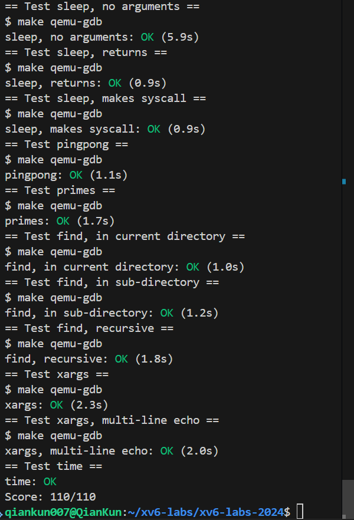
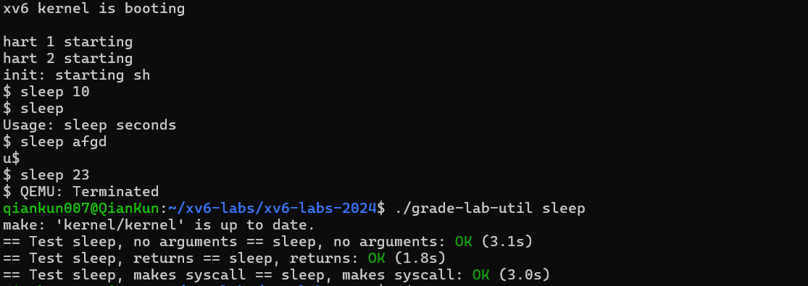
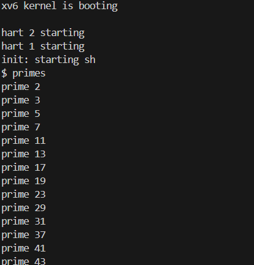
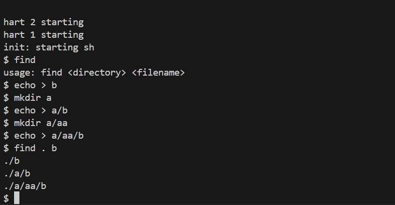
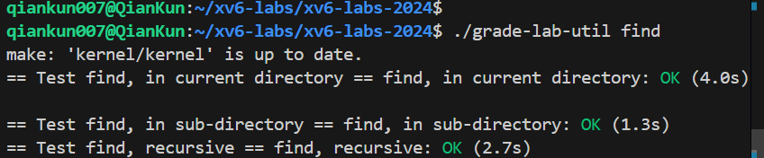
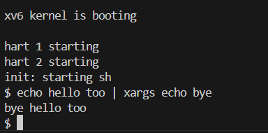
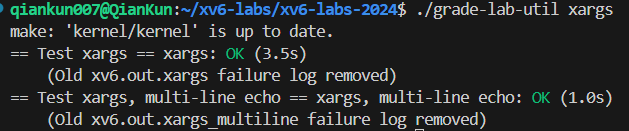

# Experiment1: xv6 Operating System and Unix Tools

- 2351232 魏义乾

---
## 目录

- [Experiment1: xv6 Operating System and Unix Tools](#experiment1-xv6-operating-system-and-unix-tools)
  - [目录](#目录)
  - [实验得分](#实验得分)
  - [实验概述](#实验概述)
  - [Task1: Sleep Utility (Simple)](#task1-sleep-utility-simple)
    - [实验目的](#实验目的)
    - [实验步骤](#实验步骤)
    - [实验结果](#实验结果)
    - [实验中遇到的问题及解决方法](#实验中遇到的问题及解决方法)
    - [实验心得](#实验心得)
  - [Task2: Pingpong Communication (Simple)](#task2-pingpong-communication-simple)
    - [实验目的](#实验目的-1)
    - [实验步骤](#实验步骤-1)
    - [实验结果](#实验结果-1)
    - [实验中遇到的问题及解决方法](#实验中遇到的问题及解决方法-1)
    - [实验心得](#实验心得-1)
  - [Task3: Primes Screening (Intermediate)](#task3-primes-screening-intermediate)
    - [实验目的](#实验目的-2)
    - [实验步骤](#实验步骤-2)
    - [实验结果](#实验结果-2)
    - [实验中遇到的问题及解决方法](#实验中遇到的问题及解决方法-2)
    - [实验心得](#实验心得-2)
  - [Task4: Find Command (Intermediate)](#task4-find-command-intermediate)
    - [实验目的](#实验目的-3)
    - [实验步骤](#实验步骤-3)
    - [实验结果](#实验结果-3)
    - [实验中遇到的问题及解决方法](#实验中遇到的问题及解决方法-3)
    - [实验心得](#实验心得-3)
  - [Task5: Xargs Tool (Intermediate)](#task5-xargs-tool-intermediate)
    - [实验目的](#实验目的-4)
    - [实验步骤](#实验步骤-4)
    - [实验结果](#实验结果-4)
    - [实验中遇到的问题及解决方法](#实验中遇到的问题及解决方法-4)
    - [实验心得](#实验心得-4)


---

## 实验得分

- 最终在util分支下执行评分：
```bash
make grade
```

- 分数：



---

## 实验概述

本次实践围绕 MIT 6.S081 2024 版 xv6 操作系统展开，目标在于熟悉其系统调用接口、用户空间开发流程以及常用系统级工具的实现思路。实验环境需预先安装 RISC-V 工具链与 QEMU，随后通过 Git 获取实验代码仓库。完成全部任务需参考《xv6 手册》第 1 章、K&R 第 5 章以及 CS:APP 并发相关章节。

---


## Task1: Sleep Utility (Simple)

### 实验目的

在xv6内核环境中，仿照UNIX sleep命令的功能，开发一个用户态的sleep工具。该工具使系统能依据用户给定的tick数量暂停执行，从而强化对xv6进程管理、接口调用以及C语言在内核开发中运用的认知。同时，熟悉xv6中用户工具的编写、构建和验证过程。

### 实验步骤

- **程序添加**：将完成的sleep工具加入Makefile的UPROGS列表中，这样在运行make qemu时，能编译并整合sleep到xv6内核，便于在xv6 shell中使用。
- **代码开发**：于user/sleep.c中创建sleep工具代码。借鉴user目录内其他工具（如rm.c、grep.c、echo.c）的参数获取方法，接收代表暂停tick数的字符串输入，并借助atoi转为整型。调用sleep接口，使工具按用户指定tick暂停。执行结束后，调用exit(0)正常终止。
- **工具验证**：在xv6 shell中执行sleep工具（如sleep 10），检查是否按给定tick暂停。利用make grade、./grade-lab-util sleep或make GRADEFLAGS=sleep grade等指令进行测试，确保通过sleep关联的所有案例。
- **错误检查**：验证用户输入，若缺少参数，则输出错误提示，指导用户正确操作该工具。
- **完整实现代码**
```
int main(int argc, char *argv[]) {
    if (argc < 2) {
        fprintf(2, "请输入参数sleep ticks！\n");
        exit(1);
    }
    int ticks = atoi(argv[1]);
    sleep(ticks);
    exit(0);
}
```

### 实验结果

- 测试：




### 实验中遇到的问题及解决方法

- **参数传递问题**：最初参数未正确传至内核。参考xv6书中的系统调用章节，检查用户到内核的接口链路，发现atoi转换后数值错误，调整后参数正常传递。
- **Makefile构建失败**：加入UPROGS后链接出错。审视Makefile的UPROGS格式，确保路径一致，最终消除构建问题。
- **字符串转换难题**：字符串到整型的转换出错。参考user/ulib.c中的atoi实现，包含头文件后顺利使用。
- **工具无响应**：执行sleep后未暂停。分析kernel/sysproc.c的sleep实现，追踪调用栈，发现输入检查遗漏，补充后工具正常运作。

### 实验心得

本次任务加深了对xv6内核架构和运作模式的认识。在构建用户态sleep工具时，不仅强化了C编程技能，还学会了内核环境中用户工具的开发策略。对接口调用的路径有了全面把握，从用户工具触发接口，到汇编进入内核处理函数，整个链路紧密相连。面对难题，通过审阅xv6文档、借鉴示例和逐步调试，逐一化解，提升了分析能力和自主学习水平。根据Tanenbaum现代操作系统原理，进程暂停机制在多任务环境中可优化资源分配，例如在I/O密集型场景中避免忙等待。


---

## Task2: Pingpong Communication (Simple)

### 实验目的
在xv6内核环境中，构建一个用户态的pingpong工具，利用一对管道（父子进程各用一个管道方向）实现进程间字节传输，强化对进程间通信（IPC）、管道管理和进程生成与协调的认知，熟悉xv6中使用pipe、fork、write、read及getpid等接口开发多进程工具的策略。

### 实验步骤
1. **代码开发**：于user/pingpong.c中创建pingpong工具代码。生成两个管道，一个供父向子发送（ping），另一个供子向父发送（pong）。借助fork()生成子进程，在父子中关闭多余管道端，随后执行数据传输、读取和显示。
2. **工具验证**：在xv6 shell中执行pingpong工具，检查是否正确实现父子间字节传输，并按要求格式显示（子先显示“<子PID>: received ping”，父后显示“<父PID>: received pong”）。利用make grade指令测试，确保通过pingpong关联的所有案例。
3. **工具添加**：将完成的pingpong工具加入Makefile的UPROGS列表中，这样在运行make qemu时，能编译并整合pingpong到xv6内核，便于在xv6 shell中使用。
- **完整实现代码**
```
int main(int argc, char *argv[]) {
    int parent_to_child[2];  //读端和写端
    int child_to_parent[2];
    char buffer = 'A';
    // 创建两个管道
    if (pipe(parent_to_child) < 0 || pipe(child_to_parent) < 0) {
        fprintf(2, "创建管道失败！\n");
        exit(1);
    }
    int pid = fork();
    if (pid < 0) {
        fprintf(2, "创建子进程失败！\n");
        exit(1);
    }
    if (pid == 0) {  //此时是子进程
        close(parent_to_child[1]);  // 关闭写端
        close(child_to_parent[0]);  // 关闭读端

        // 读取父进程发送的数据
        read(parent_to_child[0], &buffer, 1);
        printf("%d: received ping\n", getpid());

        // 向父进程发送数据
        write(child_to_parent[1], &buffer, 1);
        close(parent_to_child[0]);
        close(child_to_parent[1]);
        exit(0);
    } 
    else {// 父进程
        close(parent_to_child[0]);  // 关闭读端
        close(child_to_parent[1]);  // 关闭写端
        write(parent_to_child[1], &buffer, 1);
        read(child_to_parent[0], &buffer, 1);
        printf("%d: received pong\n", getpid());
        close(parent_to_child[1]);
        close(child_to_parent[0]);
        exit(0);
    }
}
```
### 实验结果

- 测试：
 


### 实验中遇到的问题及解决方法
1. **问题**：管道读写导致挂起或失败。
   **解决方法**：审视代码，发现父子未关闭多余端。例如，父向子传输的管道中父无需读端，子无需写端；反之亦然。关闭后，读写正常进行。
2. **问题**：Makefile构建出错。
   **解决方法**：检查Makefile的UPROGS格式，确保pingpong路径与其他一致，最终解决构建问题。
3. **问题**：不清楚双向通信的管道用法。
   **解决方法**：参考xv6文档及Linux内核管道章节，认识到需两个管道，每个管单一方向。父向子用一管（父写子读），子向父用另一管（子写父读）。
4. **问题**：显示顺序不符，父先于子显示。
   **解决方法**：检查代码，发现父读取子数据时无同步。确保父在子发送后读取，保障顺序正确。

### 实验心得
本次任务深化了对内核中进程通信机制的认识。管道作为高效通信工具，在实践中需注重创建多管双向传输、关闭多余端以防泄漏和死锁。

开发多进程工具时，进程协调至关重要，细微疏漏可致执行乱序或出错。

此外，本任务提升了对xv6开发工具的熟练度，掌握了添加和验证新用户工具的流程。根据xv6并发章节，类似管道机制在多核环境中可减少锁争用，如在NUMA架构下优化数据局部性。


---

## Task3: Primes Screening (Intermediate)
### 实验目的
在xv6内核环境中，开发一个管道驱动的并发素数筛选工具，通过多进程构建管道链路，每个进程筛选特定素数的倍数，产生2至280间所有素数。本任务深化对管道通信、进程生成与协调、并发设计及递归在内核中的运用的认知，熟悉xv6中实现高级多进程工具的策略。

### 实验步骤
1. **资源控制**：每个进程中关闭多余文件描述符，防泄漏。主进程写入后关闭写端，等待所有子结束。
2. **代码开发**：于user/primes.c中创建并发素数筛选工具代码。主函数生成首管并写入2至280整数，随后递归调用primes函数生成筛选进程。primes函数从管读取，将首数作为素数显示，并生成新管及子进程，继续过滤余数。每个进程处理一素数筛选，形成递归管链。
3. **工具添加**：将完成的primes工具加入Makefile的UPROGS列表中，这样在运行make qemu时，能编译并整合primes到xv6内核，便于在xv6 shell中使用。
4. **工具验证**：在xv6 shell中执行primes工具，检查是否正确显示2至280素数。利用make grade指令测试，确保通过primes关联的所有案例。
- **完整实现代码**
```
void primes(int fd) {
    int prime;
    if (read(fd, &prime, sizeof(int)) == 0) { //没有数据了
        close(fd);
        exit(0);
    }
    printf("prime %d\n", prime);

    int p[2];
    pipe(p);
    int pid = fork();
    if (pid < 0) {
        fprintf(2, "创建进程失败！\n");
        exit(1);
    }
    if (pid == 0) {
        close(p[1]);  
        close(fd);  
        primes(p[0]);
    } else {
        close(p[0]);  
        int i;
        while (read(fd, &i, sizeof(int)) > 0) {
            if (i % prime != 0) {
                write(p[1], &i, sizeof(int));
            }
        }
        close(fd);    // 关闭当前读端
        close(p[1]);  // 关闭写端
        wait(0);      // 等待子进程结束
        exit(0);
    }
}
```

### 实验结果

- 测试：
 

  


### 实验中遇到的问题及解决方法
1. **问题**：Makefile构建出错。
   **解决方法**：检查Makefile的UPROGS格式，确保primes路径与其他一致，最终解决构建问题。
2. **问题**：递归生成进程时栈溢出或无限循环。
   **解决方法**：函数声明加__attribute__((noreturn))，告知编译器无返回，缓解递归栈问题。同时，确保终止条件准确，防无限递归。
3. **问题**：进程未能正常结束，导致输出残缺或挂起。
   **解决方法**：分析发现文件描述符未关闭，致子无法检测写端关闭。通过进程中关闭多余描述符，确保子读取完后终止。
4. **问题**：显示顺序紊乱，素数未序显示。
   **解决方法**：检查代码，发现父子并发致乱序。确保进程输出前等待父完成，保障素数从小到大序。

### 实验心得
本次任务加深了对内核并发编程和管道机制的认识。并发素数筛选考验管道操作、进程管理和资源控制，还需精妙设计递归及系统资源。

实现中，体会到资源管理的关键性，未关描述符可致程序失效。同时，递归需考虑终止和栈用，适当声明及调用避隐患。

此外，本任务凸显调试多进程的复杂，通过关键打印和步析，最终化解过程，大幅提升问题解决及对内核底层的理解。根据Linux内核文档，并发筛在多核中可借鉴per-CPU结构，减少共享争用，如在内存分配器中应用类似局部链表。


---


## Task4: Find Command (Intermediate)
### 实验目的
在xv6内核环境中，开发一个简版UNIX find工具，用于在给定目录树中搜索特定名称文件。本任务深化对文件系统访问、目录递归、递归设计及字符串操作在内核中的运用的认知，熟悉xv6中实现文件搜索功能的策略。

### 实验步骤
1. **代码开发**：于user/find.c中创建find工具代码。借鉴user/ls.c，使用系统调用读目录。实现递归函数遍历树，对目录项检查，若目录非"."或".."，递归入子目录；若文件名称匹配，显示完整路径。
2. **路径管理**：构造完整文件路径，确保处理当前及子目录关系，防拼接出错。
3. **工具添加**：将完成的find工具加入Makefile的UPROGS列表中，这样在运行make qemu时，能编译并整合find到xv6内核，便于在xv6 shell中使用。
4. **工具验证**：在xv6 shell中执行find命令，创建测试结构，检查是否正确搜索并显示匹配路径。利用make grade指令测试，确保通过find关联的所有案例。
- **完整实现代码**
```
void find(char *path, char *target) {   //在目录path下查找文件target
    char buf[512], *p;
    int fd;
    struct dirent de;
    struct stat st;

    if ((fd = open(path, 0)) < 0) {
        fprintf(2, "find: 无法打开！ %s\n", path);
        return;
    }
    if (fstat(fd, &st) < 0) {
        fprintf(2, "find: cannot stat %s\n", path);
        close(fd);
        return;
    }
    if (strlen(path) + 1 + DIRSIZ + 1 > sizeof buf) {
        fprintf(2, "find: 路径太长！\n");
        close(fd);
        return;
    }
    strcpy(buf, path);
    p = buf + strlen(buf);
    *p++ = '/';

    while (read(fd, &de, sizeof(de)) == sizeof(de)) {
        if (de.inum == 0)
            continue;
        // 跳过 "." 和 ".."
        if (!strcmp(de.name, ".") || !strcmp(de.name, ".."))
            continue;
        memmove(p, de.name, DIRSIZ);
        p[DIRSIZ] = 0;
        if (stat(buf, &st) < 0) {
            printf("find: cannot stat %s\n", buf);
            continue;
        }
        switch (st.type) {
            case T_FILE:
                if (!strcmp(de.name, target)) {
                    printf("%s\n", buf);
                }
                break;
            case T_DIR:
                find(buf, target);
                break;
        }
    }
    close(fd);
}
```

### 实验结果

- 测试：

  
  

### 实验中遇到的问题及解决方法
1. **问题**：Makefile构建出错。
   **解决方法**：检查Makefile的UPROGS格式，确保find路径与其他一致，最终解决构建问题。
2. **问题**：路径组合出错，显示路径格式错。
   **解决方法**：审视拼接逻辑，确保目录与文件名间加"/"，并处理根特殊案。
3. **问题**：无法准确读目录项。
   **解决方法**：借鉴user/ls.c，用opendir开目录，readdir读项，closedir关。确保处理项类型及名称。
4. **问题**：递归遍历致无限循环。
   **解决方法**：检查发现未滤"."和".."，致当前与父间循环。加判断，避免递归此二特殊目录。

### 实验心得
本次任务加深了对内核文件系统操作和目录遍历的认识。find实现需掌握文件函数，还需设计递归及复杂路径处理。

实现中，体会到C字符串处理的复杂与重要，正确用strcmp、strcpy、strcat等是程序准确的关键。同时，递归需逻辑清晰及边界处理，防无限或遗漏。

此外，本任务提升了对xv6文件结构及环境的熟悉，利用ls.c示例实现新功能，对后续内核学习及开发有重大价值。根据xv6书文件章节，目录遍历在多级文件系统中可优化为深度优先搜索，以减少I/O开销，如在缓冲缓存中应用类似机制。


---

## Task5: Xargs Tool (Intermediate)

### 实验目的
在xv6内核环境中，开发一个简版UNIX xargs工具，用于从标准输入读行，并为每行执行指定命令，将行附加为命令参数。本任务深化对进程生成、命令运行、输入管理及进程通信的认知，熟悉xv6中实现命令行工具的策略。

### 实验步骤
1. **输入管理**：逐字符读标准输入，识别换行分行，并处理行尾空或特殊字符。
2. **参数管理**：解析命令参数，分离基命令及参数，为后续每行输入准备。
3. **代码开发**：于user/xargs.c中创建xargs工具代码。从标准输入读，逐行处理，每行附加为参数。用fork()生成子，在子中exec()运行命令，父用wait()等子完成。
4. **工具添加**：将完成的xargs工具加入Makefile的UPROGS列表中，这样在运行make qemu时，能编译并整合xargs到xv6内核，便于在xv6 shell中使用。
5. **工具验证**：在xv6 shell中执行xargs，结合echo、find、grep测试，检查是否正确处理输入并运行命令。用sh < xargstest.sh运行脚本，确保通过xargs关联的所有案例。
- **完整实现代码**
```

int main(int argc, char *argv[]) {
    if (argc < 2) {
        fprintf(2, "Usage: xargs command [args...]\n");
        exit(1);
    }
    // 复制命令行参数到base_argv
    char *base_argv[MAXARG];
    int i;
    for (i = 1; i < argc && i < MAXARG; i++) {
        base_argv[i-1] = argv[i];
    }
    int base_argc = i - 1;
    char line[MAXLINE];
    int len = 0;
    char c;
    // 从标准输入读取行
    while (read(0, &c, 1) > 0) {
        if (c == '\n' || len >= MAXLINE - 1) {
            line[len] = '\0';         // 终止字符串
            char *full_argv[MAXARG];  // 为当前行创建完整的参数数组
            for (int i = 0; i < base_argc; i++) {
                full_argv[i] = base_argv[i];
            }
            full_argv[base_argc] = line;      // 添加当前行作为额外参数
            full_argv[base_argc + 1] = NULL;  // 参数数组必须以NULL结尾
            int pid = fork();         // 创建子进程执行命令
            if (pid < 0) {
                fprintf(2, "进程创建失败！\n");
                exit(1);
            } else if (pid == 0) {
                exec(base_argv[0], full_argv);
                // 如果exec返回，说明执行失败
                fprintf(2, "exec执行命令失败！ %s\n", base_argv[0]);
                exit(1);
            } else {
                wait(0);
            }
            len = 0;  // 重置行长度
        } else {
            line[len++] = c;
        }
    }
    exit(0);
}
```
### 实验结果
- 测试：

  
  

### 实验中遇到的问题及解决方法
1. **问题**：子进程运行命令出错。
   **解决方法**：检查exec()参数，确保数组含命令及所有参数，以NULL终。调试发现传递错，修正后子正常运行。
2. **问题**：Makefile构建出错。
   **解决方法**：检查Makefile的UPROGS格式，确保xargs路径与其他一致，最终解决构建问题。
3. **问题**：无法完整读标准输入行。
   **解决方法**：实现逐字符逻辑，确保遇换行处理行，并处理特殊字符。加循环至文件末，防遗漏。
4. **问题**：父未等子结束。
   **解决方法**：父中加wait()，确保子完成后再下一行，防僵尸进程及乱序。

### 实验心得
本次任务加深了对内核进程生成和命令运行的认识。xargs实现需巧妙处理输入、构建参数、管理父子流程。

实现中，体会到C字符串及内存管理的关键，正确处理换行、空及数组是准确性的基础。同时，进程协调重要，用wait()避僵尸。

此外，本任务提升了对xv6工具链的熟练，与find、grep结合，理解UNIX“小而精”工具通过管组合的强大。根据xv6书进程章节，xargs式工具在批量处理中可借鉴缓冲机制，如在内存分配器中减少锁争用以提升并行效率。