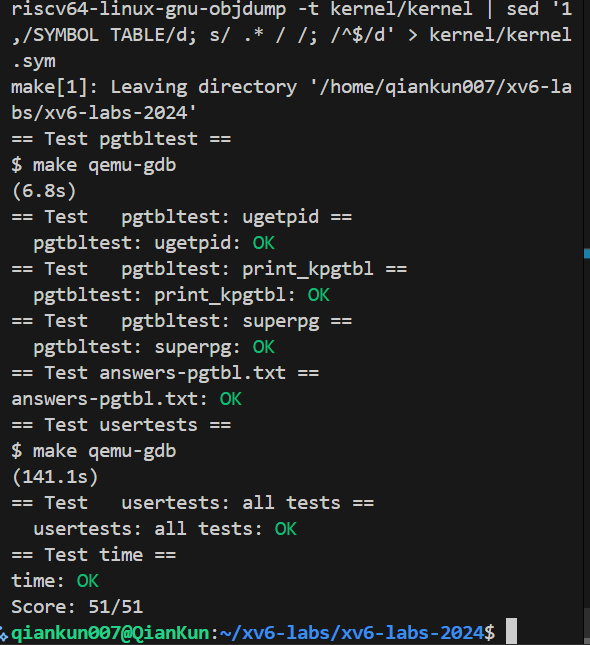
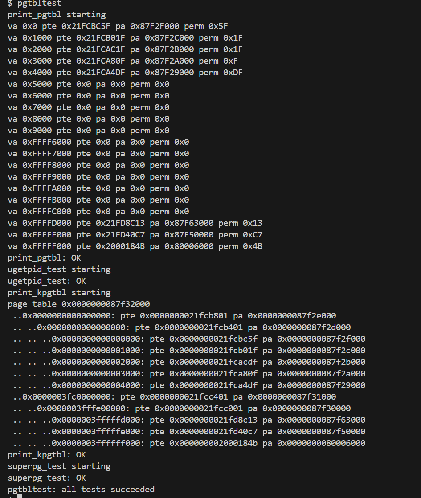
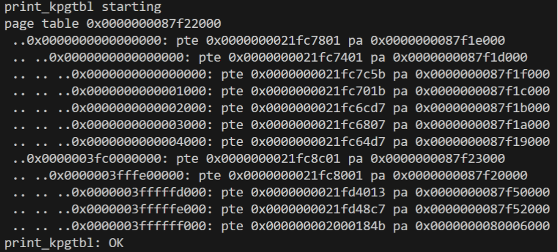
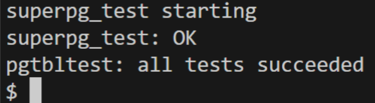

# Lab3: Page Tables

- 学号2351232 姓名魏义乾

---
## 目录

- [Lab3: Page Tables](#lab3-page-tables)
  - [目录](#目录)
  - [实验得分](#实验得分)
  - [实验概述](#实验概述)
  - [Task1: Inspect a user-process page table (easy)](#task1-inspect-a-user-process-page-table-easy)
    - [实验目的](#实验目的)
    - [实验步骤](#实验步骤)
    - [实验结果](#实验结果)
    - [实验中遇到的问题及解决方法](#实验中遇到的问题及解决方法)
    - [实验心得](#实验心得)
  - [Task2: Speed up system calls (easy)](#task2-speed-up-system-calls-easy)
    - [实验目的](#实验目的-1)
    - [实验步骤](#实验步骤-1)
    - [实验结果](#实验结果-1)
    - [实验中遇到的问题及解决方法](#实验中遇到的问题及解决方法-1)
    - [实验心得](#实验心得-1)
  - [Task3: Print a page table (easy)](#task3-print-a-page-table-easy)
    - [实验目的](#实验目的-2)
    - [实验步骤](#实验步骤-2)
    - [实验结果](#实验结果-2)
    - [实验中遇到的问题及解决方法](#实验中遇到的问题及解决方法-2)
    - [实验心得](#实验心得-2)
  - [Task4: Use superpages (moderate)/(hard)](#task4-use-superpages-moderatehard)
    - [实验目的](#实验目的-3)
    - [实验步骤](#实验步骤-3)
    - [实验结果](#实验结果-3)
    - [实验中遇到的问题及解决方法](#实验中遇到的问题及解决方法-3)
    - [实验心得](#实验心得-3)

---

## 实验得分

- 最终评分命令：
```bash
make grade
```

- 分数：


---

## 实验概述

本实验旨在深入理解 RISC-V 架构下的页表机制，并通过修改 xv6 内核实现页表相关功能优化。实验涉及用户进程页表分析、系统调用加速、页表打印和大页（Superpages）支持。通过完成这些任务，可以掌握虚拟内存管理的基本原理和实际应用，包括页表结构、权限控制、内存映射优化等。

实验要求参考以下资料：
- xv6 手册第 3 章，详细描述页表机制。
- `kernel/memlayout.h`：定义内存布局和地址空间划分。
- `kernel/vm.c`：包含页表操作的核心函数，如映射、取消映射和遍历。
- `kernel/kalloc.c`：物理内存分配器实现，用于页分配和释放。
- RISC-V 特权架构手册：描述页表项格式和硬件支持。

实验需在 `pgtbl` 分支上进行，通过修改内核代码实现功能，并通过测试用例验证正确性。

---

## Task1: Inspect a user-process page table (easy)

### 实验目的

本任务旨在分析用户进程页表项（PTE）的输出，理解每个 PTE 的逻辑内容、物理地址映射和权限位设置。通过解析 `pgtbltest` 程序的输出，掌握 RISC-V 页表项的结构和内存布局，从而加深对虚拟地址到物理地址转换过程的认识。

### 实验步骤

1. **运行测试程序**：执行 `make qemu` 并运行 `pgtbltest`，获取页表项输出。
2. **分析 PTE 格式**：根据 RISC-V 架构，PTE 包含高 44 位物理页号（PPN）和低 10 位权限位。权限位包括 `PTE_V`（有效）、`PTE_R`（可读）、`PTE_W`（可写）、`PTE_X`（可执行）、`PTE_U`（用户可访问）等。
3. **解释示例条目**：针对输出中的每个 PTE，计算物理地址并解析权限位，理解其对应内存区域的用途（如代码段、数据段、栈等）。
4. **验证内存布局**：确认 xv6 用户进程的虚拟地址空间映射是非连续的，但通过页表实现逻辑连续。

### 实验结果

通过 `pgtbltest` 输出，成功解析了页表项，验证了虚拟地址到物理地址的映射关系。输出显示用户进程的代码段、数据段和栈区域具有不同的权限设置，符合 xv6 内存布局设计。
运行结果
```
$ pgtbltest
print_pgtbl starting
va 0x0 pte 0x21FC885B pa 0x87F22000 perm 0x5B
va 0x1000 pte 0x21FC7C1B pa 0x87F1F000 perm 0x1B
va 0x2000 pte 0x21FC7817 pa 0x87F1E000 perm 0x17
va 0x3000 pte 0x21FC7407 pa 0x87F1D000 perm 0x7
va 0x4000 pte 0x21FC70D7 pa 0x87F1C000 perm 0xD7
va 0x5000 pte 0x0 pa 0x0 perm 0x0
va 0x6000 pte 0x0 pa 0x0 perm 0x0
va 0x7000 pte 0x0 pa 0x0 perm 0x0
va 0x8000 pte 0x0 pa 0x0 perm 0x0
va 0x9000 pte 0x0 pa 0x0 perm 0x0
va 0xFFFF6000 pte 0x0 pa 0x0 perm 0x0
va 0xFFFF7000 pte 0x0 pa 0x0 perm 0x0
va 0xFFFF8000 pte 0x0 pa 0x0 perm 0x0
va 0xFFFF9000 pte 0x0 pa 0x0 perm 0x0
va 0xFFFFA000 pte 0x0 pa 0x0 perm 0x0
va 0xFFFFB000 pte 0x0 pa 0x0 perm 0x0
va 0xFFFFC000 pte 0x0 pa 0x0 perm 0x0
va 0xFFFFD000 pte 0x0 pa 0x0 perm 0x0
va 0xFFFFE000 pte 0x21FD08C7 pa 0x87F42000 perm 0xC7
va 0xFFFFF000 pte 0x2000184B pa 0x80006000 perm 0x4B
print_pgtbl: OK
ugetpid_test starting
usertrap(): unexpected scause 0xd pid=4
            sepc=0x53e stval=0x3fffffd000
```


### 实验中遇到的问题及解决方法

1. **问题**：权限位解析错误，误将 PTE 整数值直接作为权限位。
   **解决方法**：使用位操作提取低 10 位（`pte & 0x3FF`）并逐位检查，确保正确识别 `PTE_V`、`PTE_R` 等标志。

2. **问题**：物理地址计算困惑，不清楚如何从 PTE 获取物理页号。
   **解决方法**：应用公式 `物理地址 = (PTE >> 10) << 12`，即先提取 PPN 再乘以页大小（4096字节）。

3. **问题**：无效 PTE 处理不当，误认为物理地址为 0x0 表示有效映射。
   **解决方法**：识别 `PTE_V` 位为 0 时，PTE 无效，物理地址无意义，访问会触发页错误。

### 实验心得

通过本任务，深入理解了 RISC-V 页表项的格式和内存映射机制。页表通过分层结构高效管理虚拟地址权限位提供精细的访问控制，确保进程隔离和系统安全。分析实际输出强化了对理论知识的掌握，并突出了调试和验证在系统编程中的重要性。此外，非连续物理映射展示了页表在内存优化中的灵活性。

---

## Task2: Speed up system calls (easy)

### 实验目的

本任务通过在内核和用户空间之间共享只读页面，优化 `getpid()` 系统调用的性能。具体目标包括：在进程创建时映射一个只读页面到用户地址 `USYSCALL`，存储进程 PID 的 `struct usyscall` 结构，使用户程序可直接读取 PID 而无须陷入内核，从而减少上下文切换开销。

### 实验步骤

1. **修改进程结构体**：在 `kernel/proc.h` 中添加字段指向共享页面。
```c
struct proc {
    // ... 现有字段 ...
    struct usyscall *usyscall_region;  // 指向共享内存区域，用于快速系统调用
};
```

2. **分配和初始化共享页面**：在 `kernel/proc.c` 的 `allocproc()` 函数中分配物理内存并初始化 PID。
```c
static struct proc* allocproc(void) {
    // ... 现有代码 ...
    
    // 分配 usyscall 页面
    if ((p->usyscall_region = (struct usyscall *)kalloc()) == 0) {
        freeproc(p);
        release(&p->lock);
        return 0;
    }
    
    // 初始化 usyscall 结构
    p->usyscall_region->pid = p->pid;
    
    // ... 现有代码 ...
}
```

3. **映射共享页面到用户空间**：在 `kernel/proc.c` 的 `procproc_pagetable`
```c
pagetable_t proc_pagetable(struct proc *p) {
    // ... 现有代码 ...
    
    // 映射 USYSCALL 页面
    if (mappages(pagetable, USYSCALL, PGSIZE, 
                 (uint64)p->usyscall_region, PTE_R | PTE_U) < 0) {
        uvmfree(pagetable, 0);
        return 0;
    }
    
    return pagetable;
}
```

4. **进程释放时清理资源**：在 `kernel/proc.c` 的 `freeproc()` 函数中释放物理页面。
```c
static void freeproc(struct proc *p) {
    // ... 现有清理代码 ...
    
    if (p->usyscall_region) {
        kfree((void*)p->usyscall_region);
        p->usyscall_region = 0;
    }
}
```

5. **取消页表映射**：在 `kernel/proc.c` 的 `proc_freepagetable()` 函数中取消映射。
```c
void proc_freepagetable(pagetable){
    // ... 现有代码 ...
    uvmunmap(pagetable, USYSCALL, 1, 0);
    // ... 现有代码 ...
}
```

### 实验结果

编译并运行 `pgtbltest` 测试用例通过，验证了共享页面正确映射和读取。



### 实验中遇到的问题及解决方法

1. **问题**：用户程序访问 `USYSCALL` 时触发页错误，因权限设置缺少 `PTE_U`。
   **解决方法**：在映射时添加 `PTE_U` 标志，确保用户模式可访问：`PTE

2. **问题**：进程退出后内存泄漏，共享页面未释放。
   **解决方法**：在 `freeproc()` 中调用 `kfree()` 释放物理页面，并在 `proc_freepagetable()` 中取消映射。

3. **问题**：`USYSCALL` 地址与其他用户内存冲突，导致映射失败。
   **解决方法**：确认 `USYSCALL` 定义在用户地址空间的空闲区域（如 `0x00001000`），避开代码段和数据段。

### 实验心得

本任务通过共享页面优化系统调用，减少了内核陷入开销，提升了性能。这种技术在真实系统（如 Linux 的 vDSO）中广泛应用。实践过程中，掌握了页表映射和权限控制的具体实现，并加深了对进程生命周期管理（分配、映射、释放）的理解。此外，错误处理的重要性凸显，确保资源释放避免泄漏。

---

## Task3: Print a page table (easy)

### 实验目的

实现 `vmprint()` 函数，以树形格式打印页表内容，包括各级页表项（PTE）的虚拟地址、PTE 值和物理地址。通过可视化页表结构，加深对 RISC-V 三级页表层次的理解，并辅助调试页表相关代码。

### 实验步骤

1. **实现递归打印函数**：在 `kernel/vm.c` 中添加 `vmprint_recursive()` 函数，递归遍历页表层级。
2. **处理缩进和**：根据层级深度添加缩进（`" .."`），并使用 `%p` 格式化输出地址。
3. **跳过无效 PTE**：仅打印 `PTE_V` 有效的项。
4. **集成到 `vmprint()`**：调用 `vmprint_recursive()` 并打印根页表地址。

**关键实现代码**：
```c
#ifdef LAB_PGTBL
```c
void vmprint_recursive(pagetable_t pagetable, int level, uint64 va_prefix) {
  for (int i = 0; i < 512; i++) {
    pte_t pte = pagetable[i];
    if (pte & PTE_V) {
      // 计算虚拟地址
      uint64 va;
      if (level == 0) {
        // L2级别：处理高位地址的符号扩展
        va = (uint64)i << 30;
        if (i >= 256) {
          va |= 0xFFFFFFC000000000ULL;  // 符号扩展
        }
      } else if (level == 1) {
        va = va_prefix | ((uint64)i << 21);
      } else {
        va = va_prefix | ((uint64)i << 12);
      }

      uint64 pa = PTE2PA(pte);

      // 打印缩进和地址信息
      printf(" ..");
      for (int j = 0; j < level; j++) {
        printf(" ..");
      }
      printf("%p: pte %p pa %p\n", (void*)va, (void*)(uint64)pte, (void*)pa);

      // 递归处理非叶子节点
      if ((pte & (PTE_R|PTE_W|PTE_X)) == 0) {
        vmprint_recursive((pagetable_t)pa, level+1, va);
      }
    }
  }
}

void vmprint(pagetable_t pagetable) {
  printf("page table %p\n", pagetable);
  vmprint_recursive(pagetable, 0, 0);
}

#endif
```

### 实验结果

运行 `print_kpgtbl`


### 实验中遇到的问题及解决方法

1. **问题**：递归逻辑错误，导致无限递归或漏打层级。
   **解决方法**：参考 `freewalk` 函数，正确设置递归终止条件（当 PTE 为叶节点时停止）。

2. **问题**：虚拟地址计算错误，输出地址不匹配。
   **解决方法**：根据层级计算步进大小（Level 2: 512*512*PGSIZE, Level 1: 512*PGSIZE, Level 0: PGSIZE）。

3. **问题**：格式化%lx输出使用错误，导致地址显示不全。
   **解决方法**：使用 `%p` 打印 64 位十六进制值，确保地址完整显示。

### 实验心得

通过实现页表打印功能，深入理解了 RISC-V 三级页表的层次结构和遍历方法。输出结果直观展示了虚拟地址到物理地址的映射链，强化了对页表机制的认识。此工具对调试页表相关代码（如映射错误、权限问题）非常有帮助。此外，递归算法的应用提高了代码的可扩展性，适用于不同层级的页表。

---

# Task4: Use superpages (moderate)/(hard)

### 实验目的

修改 xv6 内核以支持 2MB 大页（Superpages），优化大内存分配的性能。当用户程序调用 `sbrk()` 扩展堆内存时，如果新申请的区域大小 ≥ 2MB 且虚拟地址 2MB 对齐，则使用单个大页替代多个 4KB 普通页，减少页表开销和 TLB 失效，提升内存访问效率。最终通过 `pgtbltest` 中的 `superpg_test` 测试用例验证功能正确性。

### 实验步骤

1. **添加宏定义**：在 `kernel/param.h` 中定义大页大小和数量。
2. **实现大页分配器**：在 `kernel/kalloc.c` 中添加大页内存池和管理函数。
3. **修改页表映射函数**：在 `kernel/vm.c` 的 `mappages()` 中支持大页映射。
4. **修改用户内存分配**：在 `kernel/vm.c` 的 `uvmalloc()` 中优先分配大页。
5. **修改内核初始化**：在 `kernel/main.c` 的 `main()` 函数中初始化大页内存池。
6. **修改页表复制与释放**：在 `kernel/vm.c` 的 `uvmcopy()` 和 `uvmunmap()` 中添加大页支持。

#### 1. 在 `kernel/param.h` 中添加宏定义

```c
#define SUPERPAGE_SIZE (2 * 1024 * 1024)  // 2MB 大页大小
#define NSUPERPAGES 16                    // 预留大页数量
```

#### 2. 在 `kernel/kalloc.c` 中添加大页分配器

```c
struct {
  struct spinlock lock;
  char *superpages[NSUPERPAGES];
  int free[NSUPERPAGES];
  int initialized;
} superkmem;

// 初始化大页内存池
void superkinit(void) {
  initlock(&superkmem.lock, "superkmem");
  extern char end[];
  char *p = (char*)PGROUNDUP((uint64)end);
  p += 64 * PGSIZE;  // 为普通页预留空间

  for (int i = 0; i < NSUPERPAGES; i++) {
    // 确保物理地址 2MB 对齐
    while ((uint64)p % SUPERPAGE_SIZE != 0) p += PGSIZE;
    if ((uint64)p + SUPERPAGE_SIZE > PHYSTOP) break;
    superkmem.superpages[i] = p;
    superkmem.free[i] = 1;
    p += SUPERPAGE_SIZE;
  }
  superkmem.initialized = 1;
}

// 分配一个大页
void* superalloc(void) {
  acquire(&superkmem.lock);
  for (int i = 0; i < NSUPERPAGES; i++) {
    if (superkmem.free[i]) {
      superkmem.free[i] = 0;
      memset(superkmem.superpages[i], 0, SUPERPAGE_SIZE);
      release(&superkmem.lock);
      return superkmem.superpages[i];
    }
  }
  release(&superkmem.lock);
  return 0;  // 分配失败
}

// 释放一个大页
void superfree(void *pa) {
  acquire(&superkmem.lock);
  for (int i = 0; i < NSUPERPAGES; i++) {
    if (superkmem.superpages[i] == pa) {
      superkmem.free[i] = 1;
      break;
    }
  }
  release(&superkmem.lock);
}
```

#### 3. 修改 `kernel/vm.c` 中的 `mappages()` 函数以支持大页映射

```c
int mappages(pagetable_t pagetable, uint64 va, uint64 size, uint64 pa, int perm) {
  uint64 a, last;
  pte_t *pte;

  a = PGROUNDDOWN(va);
  last = PGROUNDDOWN(va + size - 1);
  for (;;) {
    // 检查是否满足大页映射条件：大小≥2MB、地址对齐且物理页来自大页池
    if (size >= SUPERPAGE_SIZE && 
        a % SUPERPAGE_SIZE == 0 && 
        pa % SUPERPAGE_SIZE == 0 &&
        superallocated(pa)) {
      pte = walk(pagetable, a, 0);  // 获取一级页表项
      if (pte == 0)
        return -1;
      if (*pte & PTE_V)
        panic("mappages: remap");
      *pte = PA2PTE(pa) | perm | PTE_V;
      a += SUPERPAGE_SIZE;
      pa += SUPERPAGE_SIZE;
      size -= SUPERPAGE_SIZE;
      if (size == 0)
        break;
      else
        continue;
    }

    // 小页映射逻辑
    if ((pte = walk(pagetable, a, 1)) == 0)
      return -1;
    if (*pte & PTE_V)
      panic("mappages: remap");
    *pte = PA2PTE(pa) | perm | PTE_V;
    if (a == last)
      break;
    a += PGSIZE;
    pa += PGSIZE;
  }
  return 0;
}
```

#### 4. 修改 `kernel/vm.c` 中的 `uvmalloc()` 函数以优先分配大页

```c
uint64
uvmalloc(pagetable_t pagetable, uint64 oldsz, uint64 newsz) {
  char *mem;
  uint64 a;

  if (newsz < oldsz)
    return oldsz;

  oldsz = PGROUNDUP(oldsz);
  for (a = oldsz; a < newsz; a += PGSIZE) {
    // 检查是否满足大页分配条件：剩余大小≥2MB且地址对齐
    if ((newsz - a) >= SUPERPAGE_SIZE && a % SUPERPAGE_SIZE == 0) {
      mem = superalloc();
      if (mem == 0) {
        goto err;
      }
      if (mappages(pagetable, a, SUPERPAGE_SIZE, (uint64)mem, PTE_W | PTE_R | PTE_U) != 0) {
        superfree(mem);
        goto err;
      }
      a += SUPERPAGE_SIZE - PGSIZE;  // 调整循环变量
      continue;
    }

    // 分配小页
    mem = kalloc();
    if (mem == 0) {
      goto err;
    }
    memset(mem, 0, PGSIZE);
    if (mappages(pagetable, a, PGSIZE, (uint64)mem, PTE_W | PTE_R | PTE_U) != 0) {
      kfree(mem);
      goto err;
    }
  }
  return newsz;

err:
  uvmunmap(pagetable, oldsz, (a - oldsz) / PGSIZE, 1);
  return oldsz;
}
```

#### 5. 修改 `kernel/main.c` 中的 `main()` 函数以初始化大页内存池

```c
int
main(void) {
  // ... 现有代码 ...
  kinit();         // 初始化物理内存分配器
  superkinit();    // 初始化大页内存池
  kvminit();       // 初始化内核页表
  // ... 后续初始化代码 ...
}
```

#### 6. 修改 `kernel/vm.c` 中的 `uvmcopy()` 和 `uvmunmap()` 以支持大页

在 `uvmcopy()` 中添加大页复制逻辑：
```c
int
uvmcopy(pagetable_t old, pagetable_t new, uint64 sz) {
  pte_t *pte;
  uint64 pa, i;
  uint flags;
  char *mem;

  for (i = 0; i < sz; i += PGSIZE) {
    if ((pte = walk(old, i, 0)) == 0)
      panic("uvmcopy: pte should exist");
    if ((*pte & PTE_V) == 0)
      panic("uvmcopy: page not present");
    pa = PTE2PA(*pte);
    flags = PTE_FLAGS(*pte);

    // 检查是否为大页
    if (issuperpage(pa)) {
      // 分配新大页并复制内容
      if ((mem = superalloc()) == 0)
        goto err;
      memmove(mem, (char*)pa, SUPERPAGE_SIZE);
      if (mappages(new, i, SUPERPAGE_SIZE, (uint64)mem, flags) != 0) {
        superfree(mem);
        goto err;
      }
      i += SUPERPAGE_SIZE - PGSIZE;  // 调整循环变量
    } else {
      // 小页复制逻辑
      if ((mem = kalloc()) == 0)
        goto err;
      memmove(mem, (char*)pa, PGSIZE);
      if (mappages(new, i, PGSIZE, (uint64)mem, flags) != 0) {
        kfree(mem);
        goto err;
      }
    }
  }
  return 0;

err:
  uvmunmap(new, 0, i / PGSIZE, 1);
  return -1;
}
```

在 `uvmunmap()` 中添加大页释放逻辑：
```c
void
uvmunmap(pagetable_t pagetable, uint64 va, uint64 npages, int do_free) {
  uint64 a;
  pte_t *pte;

  for (a = va; a < va + npages * PGSIZE; a += PGSIZE) {
    if ((pte = walk(pagetable, a, 0)) == 0)
      panic("uvmunmap: walk");
    if ((*pte & PTE_V) == 0)
      panic("uvmunmap: not mapped");
    if (PTE_FLAGS(*pte) == PTE_V)
      panic("uvmunmap: not a leaf");
    uint64 pa = PTE2PA(*pte);
    if (do_free) {
      // 检查是否为大页
      if (issuperpage(pa)) {
        superfree((void*)pa);
        a += SUPERPAGE_SIZE - PGSIZE;  // 调整循环变量
      } else {
        kfree((void*)pa);
      }
    }
    *pte = 0;
  }
}
```

### 实验结果

编译并运行 `pgtbltest`，`superpg_test` 测试用例通过，验证了大页分配和映射正确性。



### 实验中遇到的问题及解决方法

1. **问题**：大页物理地址未对齐，导致映射失败。
   **解决方法**：在 `superkinit()` 中使用 `__attribute__((aligned(SUPERPAGE_SIZE)))` 确保大页内存池 2MB 对齐，并在分配时检查对齐。

2. **问题**：页表映射层级错误，误将大页映射到二级页表。
   **解决方法**：在 `mappages()` 中直接操作一级页表项，设置 `PTE_V` 和物理地址，确保硬件识别为大页。

3. **问题**：`fork` 时大页复制失败，子进程无法继承大页。
   **解决方法**：在 `uvmcopy()` 中检测大页 PTE，使用 `superalloc()` 分配新大页并复制内容，确保子进程有独立的大页映射。

4. **问题**：进程退出时大页泄漏，未释放物理内存。
   **解决方法**：在 `uvmunmap()` 中检测大页 PTE，调用 `superfree()` 释放物理内存，确保资源正确回收。

### 实验心得

通过本任务，深入理解了超级页在内存管理中的优势和应用场景。超级页通过减少页表项数量和 TLB 失效，显著提升大内存访问性能。实现过程中，掌握了硬件对齐约束的重要性（RISC-V 要求大页物理地址 2MB 对齐），并学习了如何将大页整合到现有内存管理框架中，确保与普通页的兼容性。此外，错误处理和资源回收是关键，避免内存泄漏和系统不稳定。此技术在高性能计算、数据库和大规模应用中广泛使用，体现了虚拟内存管理的优化潜力。