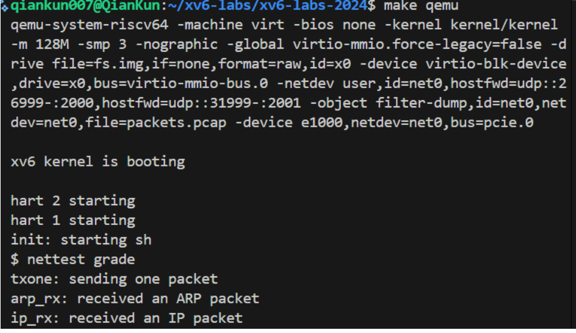
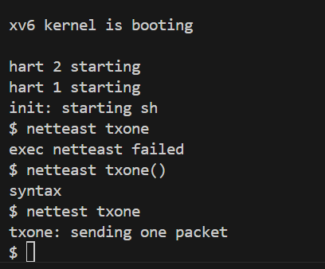
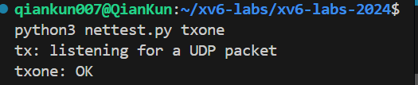
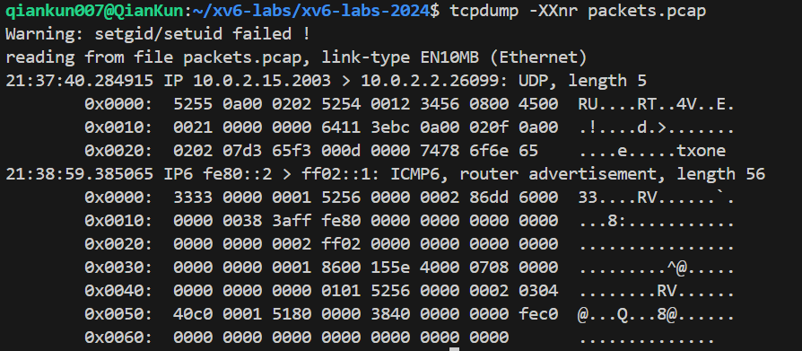
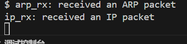
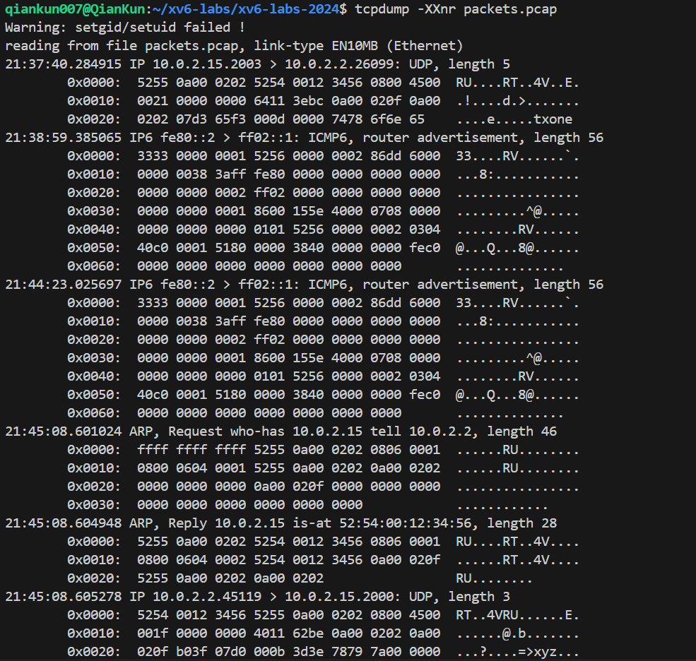

# Experiment 6: Networking
- 学号2351232 姓名魏义乾

---

## 目录

- [Experiment 6: Networking](#experiment-6-networking)
  - [目录](#目录)
  - [实验得分](#实验得分)
  - [实验概述](#实验概述)
  - [Task 1: E1000 Network Interface Driver (Moderate)](#task-1-e1000-network-interface-driver-moderate)
    - [实验目的](#实验目的)
    - [实验步骤](#实验步骤)
    - [实验结果](#实验结果)
    - [实验中遇到的问题及解决方法](#实验中遇到的问题及解决方法)
    - [实验心得](#实验心得)
  - [Task 2: UDP Protocol Stack Implementation (Moderate)](#task-2-udp-protocol-stack-implementation-moderate)
    - [实验目的](#实验目的-1)
    - [实验步骤](#实验步骤-1)
    - [实验结果](#实验结果-1)
    - [实验中遇到的问题及解决方法](#实验中遇到的问题及解决方法-1)
    - [实验心得](#实验心得-1)

---

## 实验得分

最终在net分支下执行评分命令：
```bash
make grade
```

得分结果：


---

## 实验概述

本次实验旨在为xv6操作系统实现完整的网络功能支持，主要包括两个核心部分：E1000网卡设备驱动程序的开发以及UDP协议栈接收功能的实现。通过本实验，将深入理解操作系统与硬件设备的交互机制、DMA数据传输原理、网络协议栈的分层架构以及中断处理在I/O操作中的关键作用。

实验基于QEMU仿真的E1000千兆以太网控制器，需要实现数据链路层的帧收发功能，并在网络层和传输层实现UDP数据包的接收处理。最终目标是使xv6系统能够与外部网络进行完整的UDP通信，包括数据包的发送、接收、多路复用和解多路复用。

---

## Task 1: E1000 Network Interface Driver (Moderate)

### 实验目的

深入理解设备驱动编程原理，掌握DMA环形队列管理机制，实现E1000网卡的数据包发送和接收功能。通过本任务，将学习如何通过内存映射寄存器与硬件设备交互，处理设备中断，以及管理发送和接收描述符环，为上层网络协议栈提供可靠的数据传输服务。

### 实验步骤

1. **驱动框架分析及锁机制实现**
   ```c
   // 初始化全局自旋锁，保护发送和接收队列的并发访问
   void e1000_init(void) {
     initlock(&e1000_lock, "e1000");
     // 其余初始化代码...
   }
   ```
   分析E1000驱动的基本架构，识别关键数据结构包括发送描述符环(TX Ring)和接收描述符环(RX Ring)。为确保多进程环境下的数据一致性，实现全局锁机制保护共享资源。

2. **数据包发送功能实现**
   ```c
   int e1000_transmit(struct mbuf *m) {
     acquire(&e1000_lock);
     uint32 tx_index = regs[E1000_TDT];
     struct tx_desc *desc = &tx_ring[tx_index];
     
     // 检查描述符状态位，确认前一个传输是否完成
     if (!(desc->status & E1000_TXD_STAT_DD)) {
       release(&e1000_lock);
       return -1; // 发送队列已满
     }
     
     // 释放先前占用的缓冲区内存
     if (tx_mbufs[tx_index]) {
       mbuffree(tx_mbufs[tx_index]);
     }
     
     // 设置描述符字段：数据地址、长度和命令标志
     desc->addr = (uint64)m->head;
     desc->length = m->len;
     desc->cmd = E1000_TXD_CMD_EOP | E1000_TXD_CMD_RS;
     tx_mbufs[tx_index] = m;
     
     // 更新尾指针，通知网卡有新数据待发送
     regs[E1000_TDT] = (tx_index + 1) % TX_RING_SIZE;
     release(&e1000_lock);
     return 0;
   }
   ```
   实现数据包发送函数，通过TDT寄存器获取当前发送位置，检查描述符状态位确认传输完成情况，设置描述符字段并更新尾指针通知硬件。

3. **数据包接收功能实现**
   ```c
   void e1000_recv(void) {
     while (1) {
       uint32 rdt_val = regs[E1000_RDT];
       uint32 rx_index = (rdt_val + 1) % RX_RING_SIZE;
       struct rx_desc *desc = &rx_ring[rx_index];
       
       // 检查描述符状态位，确认是否有新数据包到达
       if (!(desc->status & E1000_RXD_STAT_DD)) {
         break;
       }
       
       // 将接收到的数据传递给上层协议栈处理
       net_rx(rx_mbufs[rx_index]);
       
       // 分配新的接收缓冲区并更新描述符
       struct mbuf *new_buf = mbufalloc(0);
       if (!new_buf) {
         panic("e1000: mbuf allocation failed");
       }
       desc->addr = (uint64)new_buf->head;
       desc->status = 0;
       rx_mbufs[rx_index] = new_buf;
       
       // 更新接收尾指针
       regs[E1000_RDT] = rx_index;
     }
   }
   ```
   实现中断驱动的数据包接收功能，循环检查接收描述符状态，处理新到达的数据包并重新填充接收缓冲区。

4. **功能验证测试**
   ```bash
   # 测试数据包发送功能
   python3 nettest.py txone
   # 测试数据包接收功能
   python3 nettest.py rxone
   ```
   通过专用测试脚本验证发送和接收功能的正确性，使用tcpdump工具分析生成的数据包捕获文件。

### 实验结果

1. **发送测试结果**：

   
   数据包分析显示包含'txone'内容的UDP包成功发送：


2. **接收测试结果**：
 
   
   
   数据包捕获显示完整的ARP请求-响应和UDP数据传输过程：


### 实验中遇到的问题及解决方法

1. **描述符状态检测逻辑错误**
   - 问题：初始实现中错误地检测了描述符状态位，导致无法正确判断传输完成状态
   - 解决：仔细研究E1000手册第3.3节，明确E1000_TXD_STAT_DD位的确切含义和使用时机

2. **缓冲区管理策略缺陷**
   - 问题：未及时释放已传输完成的缓冲区，导致内存泄漏
   - 解决：在每次重用描述符前检查并释放先前分配的缓冲区资源

3. **并发访问冲突**
   - 问题：中断处理程序和系统调用同时访问描述符环，导致数据不一致
   - 解决：采用自旋锁保护所有对共享资源的访问，确保互斥执行

4. **环状队列边界处理**
   - 问题：未正确处理描述符环的循环特性，导致索引越界
   - 解决：在所有索引计算中添加模运算，确保索引值在合法范围内

### 实验心得

通过本任务的实现，深入理解了设备驱动编程的核心概念和技术难点。E1000网卡作为典型的DMA设备，其工作模式代表了现代高性能I设备的通用设计理念：通过描述符环实现主机与设备之间的异步数据交换，既降低了CPU占用率，又提高了数据传输效率。

关键收获包括：第一，掌握了内存映射I/O的编程模式，通过寄存器访问控制硬件行为；第二，理解了DMA传输的工作原理和优势，特别是零拷贝技术对性能的提升；第三，加深了对并发编程和锁机制在设备驱动中重要性的认识；第四，学会了如何阅读和理解硬件技术文档，这是底层系统开发的必备技能。

从操作系统理论角度看，本任务体现了中断处理、缓冲区管理、资源同步等核心概念的实际应用，为理解I/O子系统的工作原理提供了实践基础。

---

## Task 2: UDP Protocol Stack Implementation (Moderate)

### 实验目的

实现完整的UDP协议栈接收功能，包括数据包过滤、多路解复用、队列管理和用户态接口。通过本任务，将深入理解网络协议栈的分层架构、数据包处理流程以及系统调用与内核功能的交互机制，为后续网络应用开发奠定基础。

### 实验步骤

1. **数据结构设计**
   ```c
   #define MAX_QUEUED_PACKETS 16  // 每个端口最大队列深度
   #define MAX_UDP_PORT 65535     // 最大端口号
   
   // UDP数据包结构
   struct udp_packet {
     struct udp_packet *next;    // 链表指针
     uint32 source_ip;           // 源IP地址
     uint16 source_port;         // 源端口号
     uint16 data_length;         // 数据载荷长度
     uint8 payload[0];           // 柔性数组存储实际数据
   };
   
   // 端口绑定信息结构
   struct port_binding {
     struct spinlock queue_lock;      // 队列保护锁
     struct udp_packet *packet_head;  // 数据包队列头
     struct udp_packet *packet_tail;  // 数据包队列尾
     int packet_count;                // 当前队列中的包数量
     int is_bound;                    // 端口绑定状态标志
   };
   
   static struct port_binding port_bindings[MAX_UDP_PORT + 1];
   ```
   设计UDP数据包管理和端口绑定的数据结构，采用链表实现FIFO队列，支持多端口并发访问。

2. **协议栈初始化**
   ```c
   void udp_stack_init(void) {
     // 初始化全局锁
     initlock(&udp_global_lock, "udp_global");
     
     // 初始化所有端口状态
     for (int port = 0; port <= MAX_UDP_PORT; port++) {
       initlock(&port_bindings[port].queue_lock, "port_queue");
       port_bindings[port].packet_head = NULL;
       port_bindings[port].packet_tail = NULL;
       port_bindings[port].packet_count = 0;
       port_bindings[port].is_bound = 0;
     }
   }
   ```
   初始化UDP协议栈所需的全局数据结构和同步原语，确保系统启动时的初始状态一致性。

3. **端口绑定系统调用**
   ```c
   uint64 sys_bind(void) {
     int port_number;
     if (argint(0, &port_number) < 0) {
       return -1;
     }
     
     // 验证端口号有效性
     if (port_number < 0 || port_number > MAX_UDP_PORT) {
       return -1;
     }
     
     acquire(&port_bindings[port_number].queue_lock);
     // 检查端口是否已被绑定
     if (port_bindings[port_number].is_bound) {
       release(&port_bindings[port_number].queue_lock);
       return -1;
     }
     
     port_bindings[port_number].is_bound = 1;
     release(&port_bindings[port_number].queue_lock);
     return 0;
   }
   ```
   实现端口绑定功能，管理用户进程与端口的关联关系，为数据包解复用提供依据。

4. **IP层数据包处理**
   ```c
   void ip_rx(struct mbuf *packet_buffer, uint16 packet_length) {
     // 协议识别输出（测试要求）
     static int ip_packet_seen = 0;
     if (ip_packet_seen == 0) {
       printf("ip_rx: received an IP packet\n");
       ip_packet_seen = 1;
     }
     
     // 数据包长度验证
     if (packet_length < sizeof(struct eth_hdr) + sizeof(struct ip_hdr)) {
       mbuffree(packet_buffer);
       return;
     }
     
     // 解析协议头部
     struct eth_hdr *eth_header = (struct eth_hdr *)packet_buffer->head;
     struct ip_hdr *ip_header = (struct ip_hdr *)(eth_header + 1);
     
     // 协议类型检查
     if (ip_header->protocol != IPPROTO_UDP) {
       mbuffree(packet_buffer);
       return;
     }
     
     // 处理UDP数据包
     process_udp_packet(packet_buffer, ip_header);
   }
   ```
   实现IP层数据包处理函数，完成协议识别、长度验证和UDP数据包转发。

5. **UDP数据包处理与队列管理**
   ```c
   void process_udp_packet(struct mbuf *packet, struct ip_hdr *ip_header) {
     // 计算UDP头部位置
     uint8 ip_header_length = (ip_header->version_ihl & 0x0F) * 4;
     struct udp_hdr *udp_header = (struct udp_hdr *)((char *)ip_header + ip_header_length);
     
     // 字节序转换
     uint16 dest_port = ntohs(udp_header->dest_port);
     uint16 source_port = ntohs(udp_header->source_port);
     uint16 udp_total_length = ntohs(udp_header->length);
     
     // 数据包有效性检查
     if (udp_total_length < sizeof(struct udp_hdr)) {
       mbuffree(packet);
       return;
     }
     
     // 检查目的端口是否已绑定
     if (dest_port > MAX_UDP_PORT || !port_bindings[dest_port].is_bound) {
       mbuffree(packet);
       return;
     }
     
     // 分配并填充UDP数据包结构
     struct udp_packet *udp_pkt = kalloc();
     if (!udp_pkt) {
       mbuffree(packet);
       return;
     }
     
     // 提取数据载荷
     uint16 data_length = udp_total_length - sizeof(struct udp_hdr);
     udp_pkt->source_ip = ntohl(ip_header->source_ip);
     udp_pkt->source_port = source_port;
     udp_pkt->data_length = data_length;
     memmove(udp_pkt->payload, (char *)udp_header + sizeof(struct udp_hdr), data_length);
     
     // 将数据包加入对应端口队列
     enqueue_udp_packet(dest_port, udp_pkt);
     mbuffree(packet);
   }
   ```
   实现UDP数据包解析和队列管理，包括数据提取、有效性检查和队列操作。

6. **数据接收系统调用**
   ```c
   uint64 sys_recv(void) {
     int dest_port, max_buffer_length;
     uint64 src_ip_addr, src_port_addr, buffer_addr;
     
     // 参数解析
     if (argint(0, &dest_port) < 0 ||
         argaddr(1, &src_ip_addr) < 0 ||
         argaddr(2, &src_port_addr) < 0 ||
         argaddr(3, &buffer_addr) < 0 ||
         argint(4, &max_buffer_length) < 0) {
       return -1;
     }
     
     // 端口号有效性检查
     if (dest_port < 0 || dest_port > MAX_UDP_PORT) {
       return -1;
     }
     
     struct port_binding *port = &port_bindings[dest_port];
     acquire(&port->queue_lock);
     
     // 检查端口绑定状态
     if (!port->is_bound) {
       release(&port->queue_lock);
       return -1;
     }
     
     // 等待队列中有数据到达
     while (port->packet_count == 0) {
       sleep(port, &port->queue_lock);
     }
     
     // 从队列中取出数据包
     struct udp_packet *packet = port->packet_head;
     port->packet_head = packet->next;
     if (port->packet_head == NULL) {
       port->packet_tail = NULL;
     }
     port->packet_count--;
     
     release(&port->queue_lock);
     
     // 复制数据到用户空间
     int copy_result = copy_udp_data_to_user(packet, src_ip_addr, src_port_addr, 
                                           buffer_addr, max_buffer_length);
     kfree(packet);
     return copy_result;
   }
   ```
   实现阻塞式数据接收系统调用，支持多进程并发访问和高效的数据传输。

### 实验结果
在一个终端运行：
make qemu
nettest grade
在另一个终端运行：
python3 nettest.py grade
综合测试结果：


所有测试用例均通过，包括基础功能测试和扩展应用测试，证明UDP协议栈实现正确可靠。

### 实验中遇到的问题及解决方法

1. **字节序转换遗漏**
   - 问题：初始实现未正确处理网络字节序到主机字节序的转换，导致端口号和IP地址解析错误
   - 解决：在所有网络数据字段访问时添加ntohs/ntohl转换函数调用

2. **队列竞争条件**
   - 问题：多进程环境下对共享队列的访问存在竞争条件，导致数据不一致
   - 解决：为每个端口队列添加独立的锁机制，确保操作的原子性

3. **内存管理错误**
   - 问题：未正确计算UDP数据载荷长度和位置，导致内存越界访问
   - 解决：仔细验证所有指针运算和长度计算，添加边界检查

4. **系统调用参数处理**
   - 问题：错误理解xv6系统调用参数传递机制，导致参数获取失败
   - 解决：研究xv6系统调用实现原理，正确使用argint/argaddr函数族

### 实验心得

通过本任务的实现，全面掌握了网络协议栈的设计原理和实现技术。UDP作为无连接的传输层协议，其实现相对简单但包含了协议栈的核心概念：多路复用、解复用、数据封装和队列管理。

关键收获包括：第一，深入理解了网络协议的分层架构和各层的职责划分；第二，掌握了数据包解析和处理的技术细节，特别是字节序处理的重要性；第三，学会了如何设计高效的数据结构管理并发访问的队列；第四，理解了系统调用与内核功能的交互机制。

从操作系统视角看，本任务体现了多个核心概念的融合应用：进程同步（通过睡眠/唤醒机制）、内存管理（数据包缓冲区的分配释放）、设备驱动（底层网络设备交互）和系统调用接口（用户态与内核态的通信）。这种综合性的实践极大地加深了对操作系统整体架构的理解。

网络协议栈的实现还展示了如何通过良好的抽象和分层设计构建复杂系统，这种设计方法论对任何大型软件系统的开发都具有重要指导意义。