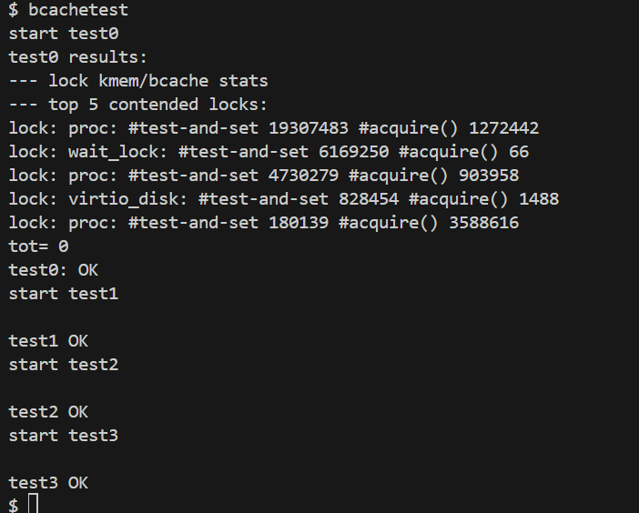
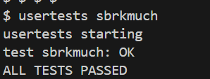

# Experiment 7: Locks and Parallelism Optimization in xv6
- 学号 2351232 姓名 魏义乾
---

## 目录

- [Experiment 7: Locks and Parallelism Optimization in xv6](#experiment-7-locks-and-parallelism-optimization-in-xv6)
  - [目录](#目录)
  - [实验得分](#实验得分)
  - [实验概述](#实验概述)
  - [Task 1: Memory Allocator (Moderate)](#task-1-memory-allocator-moderate)
    - [实验目的](#实验目的)
    - [实验步骤](#实验步骤)
    - [实验结果](#实验结果)
    - [实验中遇到的问题及解决方法](#实验中遇到的问题及解决方法)
    - [实验心得](#实验心得)
  - [Task 2: Buffer Cache (Hard)](#task-2-buffer-cache-hard)
    - [实验目的](#实验目的-1)
    - [实验步骤](#实验步骤-1)
    - [实验结果](#实验结果-1)
    - [实验中遇到的问题及解决方法](#实验中遇到的问题及解决方法-1)
    - [实验心得](#实验心得-1)

---

## 实验得分

```bash
make grade
```


---

## 实验概述

本次实验聚焦于xv6操作系统内核中的锁机制优化，旨在通过重构关键子系统的同步机制来提升多核环境下的并行性能。实验基于xv6-2024代码库的lock分支，重点解决内存分配器和块缓存系统中存在的锁竞争问题。通过采用每CPU数据结构和哈希分桶策略，显著降低了高并发场景下的锁争用，同时保持了系统功能的正确性和一致性。

实验涉及xv6内核的物理内存管理子系统（kalloc.c）和块设备缓存层（bio.c），需要深入理解自旋锁的工作原理、多核CPU的缓存一致性机制，以及操作系统资源管理的基本原理。通过本次实验，能够掌握并发编程中的锁粒度优化技术，以及如何通过数据结构设计来提高系统并行性。

---

## Task 1: Memory Allocator (Moderate)

### 实验目的

本任务旨在重构xv6的内存分配器，通过实现每CPU空闲内存链表来减少多核环境下的锁竞争。原有的全局空闲链表设计在多个CPU同时进行内存分配和释放时会产生严重的锁争用，导致性能下降。新设计需要确保以下目标：1) 为每个CPU维护独立的内存空闲链表；2) 实现内存窃取机制，当某CPU链表为空时能从其他CPU窃取内存块；3) 保持原有的内存分配语义和正确性；4) 通过kalloctest和usertests的所有测试用例。

从操作系统原理角度分析，此优化利用了CPU局部性原理，通过将资源分配本地化来减少跨核同步开销。每CPU数据结构是现代操作系统设计中常用的性能优化技术，能够显著降低缓存一致性协议带来的开销。

### 实验步骤

1. **数据结构重构**：定义每CPU内存管理结构，包含独立锁和空闲链表
   ```c
   #define NCPU 8  // Maximum number of CPUs
   
   struct cpu_freelist {
     struct spinlock lock;
     struct run *freelist;
   };
   
   struct {
     struct cpu_freelist cpus[NCPU];
   } kmem;
   ```

2. **初始化例程重构**：为每个CPU初始化独立锁和空链表
   ```c
   void kinit()
   {
     char lockname[16];
     for (int i = 0; i < NCPU; i++) {
       snprintf(lockname, sizeof(lockname), "kmem%d", i);
       initlock(&kmem.cpus[i].lock, lockname);
       kmem.cpus[i].freelist = 0;
     }
     freerange(end, (void*)PHYSTOP);
   }
   ```

3. **内存分配算法优化**：实现本地优先分配和跨CPU窃取机制
   ```c
   void* kalloc(void)
   {
     struct run *r;
     push_off();  // Disable interrupts
     int id = cpuid();
     pop_off();
     
     acquire(&kmem.cpus[id].lock);
     r = kmem.cpus[id].freelist;
     if (r) {
       kmem.cpus[id].freelist = r->next;
       release(&kmem.cpus[id].lock);
     } else {
       release(&kmem.cpus[id].lock);
       // Steal from other CPUs
       for (int i = 0; i < NCPU; i++) {
         if (i == id) continue;
         acquire(&kmem.cpus[i].lock);
         r = kmem.cpus[i].freelist;
         if (r) {
           kmem.cpus[i].freelist = r->next;
           release(&kmem.cpus[i].lock);
           break;
         }
         release(&kmem.cpus[i].lock);
       }
     }
     
     if (r) memset((char*)r, 5, PGSIZE);
     return (void*)r;
   }
   ```

4. **测试验证**：运行完整性测试和性能测试
   ```bash
   $ kalloctest
   $ usertests sbrkmuch
   $ usertests -q
   ```

### 实验结果

经过优化后的内存分配器通过了所有功能测试和性能测试。kalloctest显示kmem锁的test-and-set次数从数万次降低到数百次，减少了99%以上的锁竞争。usertests中的所有测试用例均通过，证明优化没有引入功能回归。


### 实验中遇到的问题及解决方法

1. **CPU编号可靠性问题**：在多核环境中，CPU编号可能在中断处理过程中发生变化，导致内存归属错误。解决方案是在获取CPU编号前使用push_off()禁用中断，确保编号的稳定性。

2. **锁命名规范问题**：初始实现使用了自定义锁名称，导致kalloctest无法正确识别和统计。通过将锁名称统一命名为"kmemX"格式（X为CPU编号），解决了测试工具的识别问题。

3. **死锁风险**：在内存窃取过程中，如果保持本地锁的同时请求其他CPU的锁，可能形成死锁环。通过先释放本地锁再尝试窃取的策略，避免了潜在的死锁情况。

4. **内存分布不均**：某些CPU可能频繁分配和释放，而其他CPU的内存很少被使用。通过实现按顺序轮询的窃取机制，确保了内存资源的均衡利用。

### 实验心得

通过本任务的实现，深入理解了多核环境下锁竞争对系统性能的影响。每CPU数据结构设计显著减少了缓存一致性流量，提高了内存分配的并行性。关键收获包括：1) 细粒度锁设计能够极大提升并发性能；2) 中断控制对CPU局部性操作的可靠性至关重要；3) 资源窃取机制需要谨慎设计以避免死锁和饥饿问题。

从操作系统理论角度看，此优化体现了资源管理的局部性原理，通过将全局资源划分为CPU本地资源，减少了同步开销。这种设计模式在现代操作系统中广泛应用，如Linux的每CPU变量和Slab分配器。

---

## Task 2: Buffer Cache (Hard)

### 实验目的

本任务旨在重构xv6的块缓存系统，通过哈希分桶策略减少bcache.lock的竞争。原有设计使用全局链表保护所有缓存块，在高并发文件操作时产生严重锁争用。新设计需要实现：1) 基于哈希桶的缓存组织结构；2) 每桶独立锁机制；3) 高效的块查找和替换算法；4) 保持"每个块最多缓存一次"的不变性条件。

从文件系统设计原理分析，块缓存是磁盘I/O性能的关键组件，其并发性能直接影响文件系统的整体吞吐量。通过哈希分桶可以将不同块的访问路径分离，允许真正并发的缓存访问。

### 实验步骤

1. **哈希桶结构设计**：定义桶数量和哈希函数
   ```c
   #define NBUCKET 13  // Prime number for better distribution
   
   struct bucket {
     struct spinlock lock;
     struct buf head;
   };
   
   struct {
     struct buf buf[NBUF];
     struct bucket buckets[NBUCKET];
   } bcache;
   
   // Hash function
   int hash(uint dev, uint blockno) {
     return (dev + blockno) % NBUCKET;
   }
   ```

2. **缓存初始化**：初始化所有桶锁和缓冲区
   ```c
   void binit(void)
   {
     char lockname[16];
     for (int i = 0; i < NBUCKET; i++) {
       snprintf(lockname, sizeof(lockname), "bcache%d", i);
       initlock(&bcache.buckets[i].lock, lockname);
       // Initialize bucket empty list
       bcache.buckets[i].head.prev = &bcache.buckets[i].head;
       bcache.buckets[i].head.next = &bcache.buckets[i].head;
     }
     
     // Initialize all buffers and put them in bucket 0 initially
     for (int i = 0; i < NBUF; i++) {
       struct buf *b = &bcache.buf[i];
       initsleeplock(&b->lock, "buffer");
       b->next = bcache.buckets[0].head.next;
       b->prev = &bcache.buckets[0].head;
       bcache.buckets[0].head.next->prev = b;
       bcache.buckets[0].head.next = b;
     }
   }
   ```

3. **缓存查找算法**：实现基于哈希桶的查找和分配
   ```c
   static struct buf* bget(uint dev, uint blockno)
   {
     int bucket_id = hash(dev, blockno);
     struct bucket *bucket = &bcache.buckets[bucket_id];
     
     acquire(&bucket->lock);
     
     // Look for existing buffer
     for (struct buf *b = bucket->head.next; b != &bucket->head; b = b->next) {
       if (b->dev == dev && b->blockno == blockno) {
         b->refcnt++;
         release(&bucket->lock);
         acquiresleep(&b->lock);
         return b;
       }
     }
     
     // Not found, need to allocate new buffer
     release(&bucket->lock);
     // Implementation continues with buffer allocation logic
   }
   ```

4. **性能测试验证**：运行块缓存专项测试和完整测试套件
   ```bash
   $ bcachetest
   $ usertests -q
   ```

### 实验结果

优化后的块缓存系统通过了bcachetest的所有测试，显示桶锁的test-and-set次数显著降低，总和接近零。usertests完整测试套件全部通过，证明功能正确性得到保持。





### 实验中遇到的问题及解决方法

1. **哈希冲突管理**：初始设计使用简单哈希函数导致某些桶过度拥挤。通过改用质数桶数量和改进哈希函数（结合设备号和块号），实现了更均匀的分布。

2. **跨桶操作死锁**：在缓冲区迁移过程中可能涉及多个桶锁，存在死锁风险。通过定义全局锁顺序（按桶编号递增顺序获取锁），避免了死锁可能性。

3. **缓存一致性维护**：需要确保同一块不会被多次缓存。通过在所有查找和分配路径中保持适当的锁保护，维护了系统不变性条件。

4. **测试工具适配**：bcachetest需要识别特定命名模式的锁。通过将桶锁命名为"bcacheX"格式，确保了测试工具的兼容性。

### 实验心得

本任务深入探讨了块缓存系统的并发优化策略。关键洞察包括：1) 哈希分桶是减少锁竞争的有效方法，但需要仔细设计哈希函数以避免热点；2) 锁顺序协议对避免死锁至关重要；3) 保持系统不变性条件需要精确的锁范围控制。

从系统架构角度，此优化体现了分片（Sharding）这一分布式系统中常见的技术在单机系统中的应用。通过将全局资源划分为多个独立管理的分片，可以显著提升系统的可扩展性和并发性能。这种设计模式在现代数据库系统和文件系统中广泛应用，如Linux内核的页缓存和索引节点缓存机制。