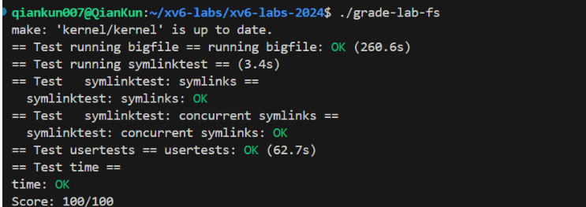
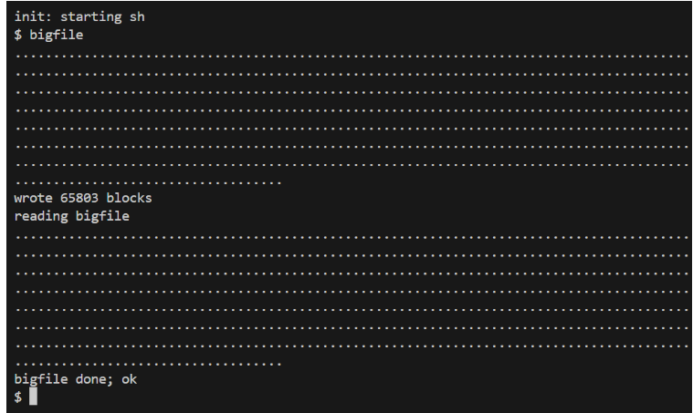
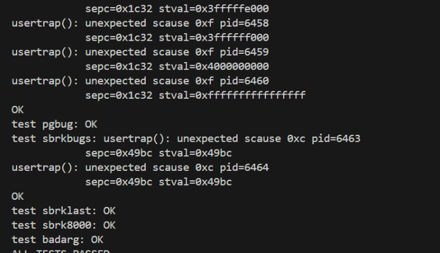
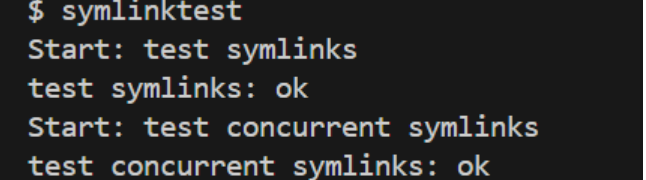

# Experiment 8: File System

- 学号 2351232 姓名 魏义乾

---

## 目录

- [Experiment 8: File System](#experiment-8-file-system)
  - [目录](#目录)
  - [实验得分](#实验得分)
  - [实验概述](#实验概述)
  - [Task1: Large Files (Moderate)](#task1-large-files-moderate)
    - [实验目的](#实验目的)
    - [实验步骤](#实验步骤)
    - [实验结果](#实验结果)
    - [实验中遇到的问题及解决方法](#实验中遇到的问题及解决方法)
    - [实验心得](#实验心得)
  - [Task2: Symbolic Links (Moderate)](#task2-symbolic-links-moderate)
    - [实验目的](#实验目的-1)
    - [实验步骤](#实验步骤-1)
    - [实验结果](#实验结果-1)
    - [实验中遇到的问题及解决方法](#实验中遇到的问题及解决方法-1)
    - [实验心得](#实验心得-1)

---

## 实验得分

- 最终在fs分支下跑分：
```bash
make grade
```

- 得分：



---

## 实验概述

本实验基于 xv6-2024 操作系统，旨在扩展其文件系统功能，主要包括两个任务：实现大文件支持通过双重间接块机制，以及添加符号链接系统调用。通过修改 xv6 内核代码，深入理解文件系统的存储结构、inode 管理、路径解析和系统调用实现原理。实验涉及操作系统核心概念，如块分配、缓冲区缓存、inode 操作和系统调用处理，是对文件系统设计与实现的全面实践。

---

## Task1: Large Files (Moderate)

### 实验目的

本任务旨在扩展 xv6 文件系统的文件大小限制，从原有的 268 块（约 268KB）提升至 65,803 块（约 65MB）。通过引入双重间接块（double-indirect block）机制，解决原系统仅支持 12 个直接块和 1 个单间接块的局限性。从技术层面，这涉及 inode 结构的重新设计、块映射逻辑的扩展，以及文件截断处理的增强，从而深入理解文件系统中多级索引结构的原理与实现，提升对磁盘块管理、缓存机制和系统性能优化的认识。

### 实验步骤

1. **初始测试与问题分析**：首先运行 `bigfile` 测试程序，确认原系统限制为 268 块，作为基准测试。
   ```bash
   $ bigfile
   ```

2. **修改 inode 结构定义**：调整 `fs.h` 中的 `NDIRECT` 常量，减少直接块数量至 11，并为双重间接块预留空间。同时更新 `struct dinode` 和 `file.h` 中的 `struct inode`，确保内存和磁盘结构一致。
   ```c
   #define NDIRECT 11
   #define NINDIRECT (BSIZE / sizeof(uint))
   #define NDINDIRECT (NINDIRECT * NINDIRECT)
   #define MAXFILE (NDIRECT + NINDIRECT + NDINDIRECT)
   
   struct dinode {
     // ... 其他字段
     uint addrs[NDIRECT + 2]; // 11 direct + 1 singly-indirect + 1 doubly-indirect
   };
   ```

3. **实现双重间接块映射逻辑**：在 `fs.c` 的 `bmap()` 函数中添加双重间接块处理代码，包括两级间接块的分配、读取和映射。关键点在于计算逻辑块号偏移，并递归处理间接块。
   ```c
   if (bn < NDIRECT) {
     // 处理直接块
   } else if (bn < NDIRECT + NINDIRECT) {
     // 处理单间接块
   } else {
     bn -= NDIRECT + NINDIRECT;
     if (bn < NDINDIRECT) {
       // 处理双重间接块：第一级间接块
       if ((addr = ip->addrs[NDIRECT + 1]) == 0)
         ip->addrs[NDIRECT + 1] = addr = balloc(ip->dev);
       struct buf *bp = bread(ip->dev, addr);
       uint *a = (uint *)bp->data;
       uint idx1 = bn / NINDIRECT;
       if ((addr = a[idx1]) == 0) {
         a[idx1] = addr = balloc(ip->dev);
         log_write(bp);
       }
       brelse(bp);
       
       // 第二级间接块
       bp = bread(ip->dev, addr);
       a = (uint *)bp->data;
       uint idx2 = bn % NINDIRECT;
       if ((addr = a[idx2]) == 0) {
         a[idx2] = addr = balloc(ip->dev);
         log_write(bp);
       }
       brelse(bp);
       return addr;
     }
   }
   ```

4. **增强文件截断功能**：修改 `itrunc()` 函数以释放双重间接块及其所有子块，确保资源正确回收。需遍历两级间接块，逐级释放数据块和间接块。
   ```c
   if (ip->addrs[NDIRECT + 1]) {
     struct buf *bp = bread(ip->dev, ip->addrs[NDIRECT + 1]);
     uint *a = (uint *)bp->data;
     for (int i = 0; i < NINDIRECT; i++) {
       if (a[i]) {
         struct buf *bp2 = bread(ip->dev, a[i]);
         uint *a2 = (uint *)bp2->data;
         for (int j = 0; j < NINDIRECT; j++) {
           if (a2[j])
             bfree(ip->dev, a2[j]);
         }
         brelse(bp2);
         bfree(ip->dev, a[i]);
       }
     }
     brelse(bp);
     bfree(ip->dev, ip->addrs[NDIRECT + 1]);
     ip->addrs[NDIRECT + 1] = 0;
   }
   ```

5. **验证与测试**：重新编译系统后运行 `bigfile` 和 `usertests`，确认大文件创建成功且系统稳定性无损。
   ```bash
   $ make qemu
   $ bigfile
   $ usertests -q
   ```

### 实验结果

1. **大文件测试**：成功创建 65,803 块的文件，输出如下：
   ```
   wrote 65803 blocks
   done; ok
   ```
   

2. **系统测试**：`usertests` 全部通过，证明文件系统功能完整：
   ```
   ALL TESTS PASSED
   ```
 

### 实验中遇到的问题及解决方法

1. **逻辑块号计算错误**：初始实现中，双重间接块的偏移计算未正确跳过直接块和单间接块区域，导致文件数据错位。通过重新计算 `bn -= NDIRECT + NINDIRECT` 并验证映射公式解决。
2. **缓冲区泄漏**：在 `bmap()` 中，未及时释放中间缓冲区（如读取间接块后），导致缓存耗尽。添加 `brelse()` 调用确保每个 `bread()` 都有配对释放。
3. **磁盘镜像损坏**：测试失败后 `fs.img` 可能损坏，通过删除镜像并运行 `make clean` 重新生成解决。

### 实验心得

通过本任务，深入理解了文件系统中多级索引结构的设计原理。双重间接块机制显著扩展了文件大小，但也引入了额外的磁盘访问开销，体现了空间与时间的权衡。在实现中，精确的块映射和资源管理至关重要，任何错误都可能导致数据损坏或系统崩溃。参考 xv6 book 第 8 章，进一步认识到 inode 和块缓存如何协同工作以提升性能。此实验增强了系统编程和调试能力，为后续文件系统开发打下基础。

---

## Task2: Symbolic Links (Moderate)

### 实验目的

本任务旨在 xv6 文件系统中实现符号链接（soft link）功能，允许创建指向其他文件或目录的路径引用。符号链接与硬链接不同，它不受同一文件系统限制，并可指向目录，提供了更大的灵活性。通过添加 `symlink` 系统调用和修改 `open` 处理逻辑，学习路径解析、inode 类型管理和系统调用实现，深入理解操作系统中的链接机制和文件系统扩展方法。

### 实验步骤

1. **系统调用与类型定义**：在 `syscall.h` 中添加系统调用号，在 `usys.pl` 和 `user.h` 中添加用户接口，并在 `stat.h` 中定义新的文件类型 `T_SYMLINK`。
   ```c
   // syscall.h
   #define SYS_symlink 22

   // user.h
   int symlink(const char *target, const char *path);

   // stat.h
   #define T_SYMLINK 4
   ```

2. **实现 `symlink` 系统调用**：在 `sysfile.c` 中实现 `sys_symlink`，创建符号链接文件并将其目标路径写入 inode 数据块。
   ```c
   uint64 sys_symlink(void) {
     char target[MAXPATH], path[MAXPATH];
     if (argstr(0, target, MAXPATH) < 0 || argstr(1, path, MAXPATH) < 0)
       return -1;
     begin_op();
     struct inode *ip = create(path, T_SYMLINK, 0, 0);
     if (ip == 0) {
       end_op();
       return -1;
     }
     // 将目标路径写入 inode 数据块
     if (writei(ip, 0, (uint64)target, 0, MAXPATH) < MAXPATH) {
       iunlockput(ip);
       end_op();
       return -1;
     }
     iunlockput(ip);
     end_op();
     return 0;
   }
   ```

3. **修改 `open` 系统调用以支持符号链接解析**：在 `sysfile.c` 的 `sys_open` 中添加逻辑，递归解析符号链接，直到找到非链接文件或达到深度限制。
   ```c
   if (ip->type == T_SYMLINK && !(omode & O_NOFOLLOW)) {
     for (int depth = 0; depth < 10; depth++) {
       char target[MAXPATH];
       if (readi(ip, 0, (uint64)target, 0, MAXPATH) != MAXPATH) {
         iunlockput(ip);
         end_op();
         return -1;
       }
       iunlockput(ip);
       ip = namei(target);
       if (ip == 0) {
         end_op();
         return -1;
       }
       ilock(ip);
       if (ip->type != T_SYMLINK) {
         break;
       }
     }
     if (ip->type == T_SYMLINK) {
       iunlockput(ip);
       end_op();
       return -1; // 循环链接或深度超过限制
     }
   }
   ```

4. **添加 `O_NOFOLLOW` 标志**：在 `fcntl.h` 中定义新标志，允许打开符号链接本身而非目标文件。
   ```c
   #define O_NOFOLLOW 0x004
   ```

5. **测试与验证**：编译系统后运行 `symlinktest` 和 `usertests`，确保符号链接功能正确且系统稳定。
   ```bash
   $ make qemu
   $ symlinktest
   $ usertests -q
   ```

### 实验结果

1. **符号链接测试**：`symlinktest` 成功通过，包括基本链接功能和并发测试：
   ```
   Start: test symlinks
   test symlinks: ok
   Start: test concurrent symlinks
   test concurrent symlinks: ok
   ```
 

2. **系统测试**：`usertests` 全部通过，证明符号链接实现未破坏现有功能：
   ```
   ALL TESTS PASSED
   ```
   

### 实验中遇到的问题及解决方法

1. **链接解析深度限制**：初始实现未处理循环链接，可能导致无限递归。通过添加最大深度限制（10 层）解决，超过时返回错误。
2. **路径缓冲区溢出**：`readi` 和 `writei` 操作时，未确保路径长度不超过 `MAXPATH`。通过严格使用 `MAXPATH` 常量限制读写长度避免溢出。
3. **并发竞争条件**：多进程同时解析符号链接时，可能因 inode 锁未正确管理而导致数据竞争。使用 `ilock` 和 `iunlock` 确保原子操作。

### 实验心得

本任务深入实现了符号链接机制，学习了如何通过系统调用扩展文件系统功能。符号链接的递归解析涉及复杂的路径查找和 inode 管理，强调了错误处理和边界条件的重要性。参考 Linux 内核中的符号链接实现，认识到安全性和性能之间的平衡（如深度限制）。此实验加深了对文件系统架构的理解，特别是 inode 数据块的使用和系统调用处理流程，为后续操作系统开发提供了宝贵经验。