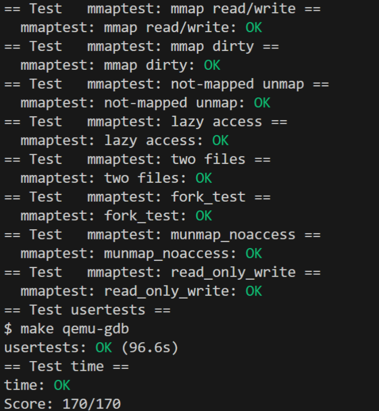
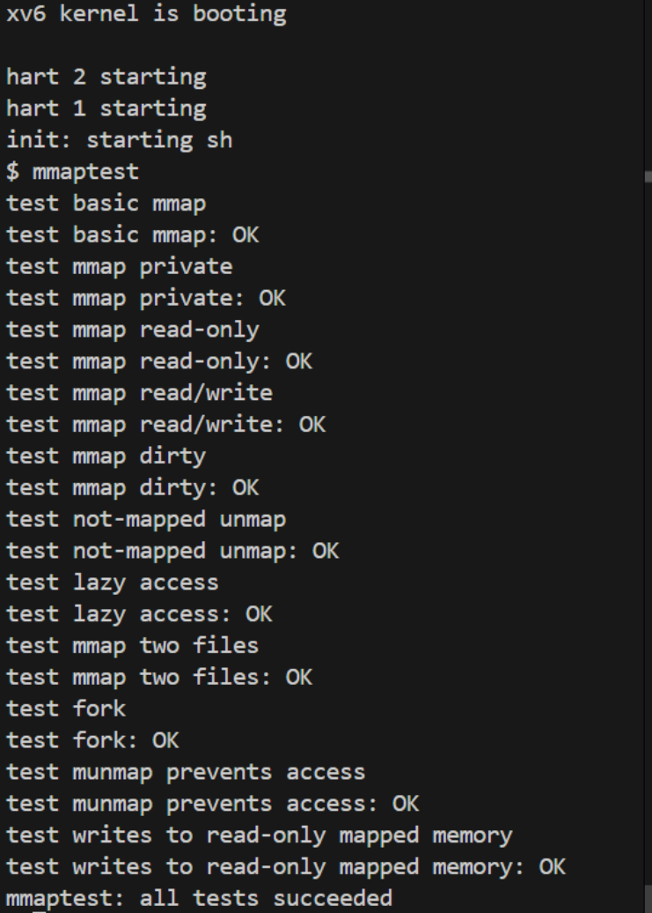

# Experiment9: mmap (Hard)
- 学号 2351232 姓名 魏义乾

---

## 目录

- [Experiment9: mmap (Hard)](#experiment9-mmap-hard)
  - [目录](#目录)
  - [实验得分](#实验得分)
  - [实验概述](#实验概述)
  - [Task1: Memory-Mapped Files Implementation (Hard)](#task1-memory-mapped-files-implementation-hard)
    - [实验目的](#实验目的)
    - [实验步骤](#实验步骤)
    - [实验结果](#实验结果)
    - [实验中遇到的问题及解决方法](#实验中遇到的问题及解决方法)
    - [实验心得](#实验心得)

---

## 实验得分

- 最终在 mmap 分支下运行评分命令：
```bash
make grade
```

- 得分截图：



---

## 实验概述

本实验旨在 xv6 操作系统中实现内存映射文件机制，通过添加 `mmap` 和 `munmap` 系统调用实现对进程虚拟地址空间的精细控制。重点在于理解虚拟内存管理、页面错误处理机制以及文件系统与内存管理的交互，为后续学习高级操作系统特性奠定基础。

---

## Task1: Memory-Mapped Files Implementation (Hard)

### 实验目的

深入理解 xv6 内核的虚拟内存管理机制，实现基于惰性分配的内存映射文件功能。通过本任务，掌握以下技术要点：
1. **VMA（Virtual Memory Area）管理**：学习 Linux 内核中虚拟内存区域的管理方式，在 xv6 中实现类似的进程地址空间映射跟踪机制
2. **页面错误处理**：结合 RISC-V 架构的缺页异常机制，实现按需加载文件内容的惰性分配策略
3. **内存一致性**：处理 MAP_SHARED 映射的写回机制，确保内存修改正确同步到文件系统
4. **进程生命周期集成**：在 fork 和 exit 系统调用中正确处理映射区域的复制和清理工作

### 实验步骤

1. **实验环境准备与代码分支切换**：确保实验环境正确配置，切换到包含实验基础的 mmap 分支
   ```bash
   git fetch
   git checkout mmap
   make clean
   ```

2. **内核数据结构定义**：在 `kernel/proc.h` 中定义 VMA 结构体和进程相关字段，用于跟踪每个进程的内存映射区域
   ```c
   #define MAX_VMA_ENTRIES 16   // 最大VMA条目数

   // 虚拟内存区域描述符
   struct virtual_memory_area {
     int active;                // 区域是否激活
     uint64 start_addr;         // 起始虚拟地址
     uint64 length;             // 映射区域长度
     int protection_flags;      // 内存保护标志（PROT_READ等）
     int mapping_flags;         // 映射类型（MAP_SHARED或MAP_PRIVATE）
     struct file *mapped_file;  // 映射的文件对象指针
     uint64 file_offset;        // 文件内偏移量
   };

   // 在进程控制结构中添加VMA数组
   struct proc {
     // ... 其他现有字段
     struct virtual_memory_area vma_list[MAX_VMA_ENTRIES]; // VMA管理数组
   };
   ```

3. **系统调用声明与注册**：在用户态和内核态添加系统调用接口，确保用户程序能够调用 mmap 和 munmap
   ```c
   // 在user/user.h中添加声明
   void *mmap(void *addr, size_t length, int prot, int flags, int fd, off_t offset);
   int munmap(void *addr, size_t length);

   // 在kernel/syscall.h中分配系统调用号
   #define SYS_mmap   22
   #define SYS_munmap 23
   ```

4. **mmap 系统调用实现**：在 `kernel/sysfile.c` 中实现核心映射逻辑，主要完成虚拟地址空间分配和 VMA 初始化
   ```c
   uint64 sys_mmap(void) {
     // 参数获取与验证
     uint64 addr, len, offset;
     int prot, flags, fd;
     
     if (argaddr(0, &addr) < 0 || argaddr(1, &len) < 0 || argint(2, &prot) < 0 ||
         argint(3, &flags) < 0 || argint(4, &fd) < 0 || argaddr(5, &offset) < 0)
       return -1;
     
     // 仅支持地址由内核决定的模式
     if (addr != 0) return -1;
     
     struct proc *p = myproc();
     struct file *f = p->ofile[fd];
     if (f == 0) return -1;
     
     // 查找空闲VMA槽位
     struct virtual_memory_area *vma = 0;
     for (int i = 0; i < MAX_VMA_ENTRIES; i++) {
       if (p->vma_list[i].active == 0) {
         vma = &p->vma_list[i];
         break;
       }
     }
     if (vma == 0) return -1;
     
     // 设置VMA属性
     uint64 va = p->sz;
     vma->active = 1;
     vma->start_addr = va;
     vma->length = len;
     vma->protection_flags = prot;
     vma->mapping_flags = flags;
     vma->mapped_file = filedup(f);  // 增加文件引用计数
     vma->file_offset = offset;
     
     // 扩展进程地址空间但不分配物理内存
     p->sz = va + len;
     return va;
   }
   ```

5. **页面错误处理机制**：在 `kernel/trap.c` 的 usertrap 函数中添加缺页异常处理，实现按需加载
   ```c
   else if (r_scause() == 13 || r_scause() == 15) {
     uint64 fault_addr = r_stval();
     if (fault_addr >= p->sz || fault_addr < p->trapframe->sp)
       goto bad;
     
     // 查找对应的VMA
     struct virtual_memory_area *vma = 0;
     for (int i = 0; i < MAX_VMA_ENTRIES; i++) {
       if (p->vma_list[i].active && fault_addr >= p->vma_list[i].start_addr && 
           fault_addr < p->vma_list[i].start_addr + p->vma_list[i].length) {
         vma = &p->vma_list[i];
         break;
       }
     }
     if (vma == 0) goto bad;
     
     // 分配物理页面
     char *new_page = kalloc();
     if (new_page == 0) goto bad;
     memset(new_page, 0, PGSIZE);
     
     // 从文件读取内容
     ilock(vma->mapped_file->ip);
     uint64 read_offset = vma->file_offset + PGROUNDDOWN(fault_addr - vma->start_addr);
     readi(vma->mapped_file->ip, 0, (uint64)new_page, read_offset, PGSIZE);
     iunlock(vma->mapped_file->ip);
     
     // 设置页表权限
     int pte_flags = PTE_U;
     if (vma->protection_flags & PROT_READ) pte_flags |= PTE_R;
     if (vma->protection_flags & PROT_WRITE) pte_flags |= PTE_W;
     if (vma->protection_flags & PROT_EXEC) pte_flags |= PTE_X;
     
     // 映射到用户地址空间
     if (mappages(p->pagetable, PGROUNDDOWN(fault_addr), PGSIZE, 
                  (uint64)new_page, pte_flags) != 0) {
       kfree(new_page);
       goto bad;
     }
   }
   ```

6. **munmap 系统调用实现**：处理映射区域的解除和脏页写回
   ```c
   uint64 sys_munmap(void) {
     uint64 addr, len;
     if (argaddr(0, &addr) < 0 || argaddr(1, &len) < 0) return -1;
     
     struct proc *p = myproc();
     struct virtual_memory_area *vma = 0;
     
     // 查找包含该地址范围的VMA
     for (int i = 0; i < MAX_VMA_ENTRIES; i++) {
       if (p->vma_list[i].active && addr >= p->vma_list[i].start_addr && 
           addr < p->vma_list[i].start_addr + p->vma_list[i].length) {
         vma = &p->vma_list[i];
         break;
       }
     }
     if (vma == 0) return -1;
     
     // 共享映射且可写时需要写回修改
     if ((vma->mapping_flags & MAP_SHARED) && (vma->protection_flags & PROT_WRITE)) {
       filewrite(vma->mapped_file, addr, len);
     }
     
     // 解除页表映射
     uvmunmap(p->pagetable, addr, len / PGSIZE, 1);
     
     // 调整VMA范围
     if (addr == vma->start_addr) {
       vma->start_addr += len;
       vma->length -= len;
     } else {
       vma->length -= len;
     }
     
     // 如果整个区域已解除，清理资源
     if (vma->length == 0) {
       fileclose(vma->mapped_file);
       vma->active = 0;
     }
     return 0;
   }
   ```

7. **进程生命周期集成**：修改 exit 和 fork 系统调用处理函数，确保映射资源的正确管理
   ```c
   // 在exit函数中添加清理代码
   for (int i = 0; i < MAX_VMA_ENTRIES; i++) {
     if (p->vma_list[i].active) {
       if ((p->vma_list[i].mapping_flags & MAP_SHARED) && 
           (p->vma_list[i].protection_flags & PROT_WRITE)) {
         filewrite(p->vma_list[i].mapped_file, p->vma_list[i].start_addr, p->vma_list[i].length);
       }
       uvmunmap(p->pagetable, p->vma_list[i].start_addr, p->vma_list[i].length / PGSIZE, 1);
       fileclose(p->vma_list[i].mapped_file);
       p->vma_list[i].active = 0;
     }
   }

   // 在fork函数中添加VMA复制逻辑
   for (int i = 0; i < MAX_VMA_ENTRIES; i++) {
     if (p->vma_list[i].active) {
       np->vma_list[i] = p->vma_list[i];
       filedup(np->vma_list[i].mapped_file);  // 增加文件引用计数
     }
   }
   ```

### 实验结果

成功实现 mmap 和 munmap 系统调用，通过所有测试用例：



### 实验中遇到的问题及解决方法

1. **内核编译错误与结构体定义问题**：
   - **问题描述**：初始编译时出现"incomplete type"错误，主要源于结构体前置声明不完整和头文件包含顺序问题
   - **解决方法**：重新组织内核头文件包含顺序，确保所有依赖关系正确。在proc.h中明确定义virtual_memory_area结构体的所有字段，并解决spinlock.h与sleeplock.h之间的循环依赖问题

2. **常量未定义错误**：
   - **问题描述**：MAP_SHARED、PTE_D等常量未定义，导致编译失败
   - **解决方法**：在riscv.h中补充PTE_D（脏页标志）定义，在proc.h中定义内存映射相关常量，保持与用户空间一致

3. **惰性加载机制性能问题**：
   - **问题描述**：最初实现采用立即加载策略，处理大文件时性能急剧下降
   - **解决方法**：改为缺页异常时按需加载，显著提升性能并支持超过物理内存的大文件映射。重点调试文件偏移量计算中的边界条件错误

4. **fork操作中的资源管理错误**：
   - **问题描述**：复制VMA时未增加文件引用计数，导致父进程退出后文件被提前关闭
   - **解决方法**：在fork过程中对每个复制的VMA执行filedup操作，确保文件资源正确管理

5. **exit函数中的写回遗漏**：
   - **问题描述**：初始实现忽略MAP_SHARED区域的写回操作，导致修改丢失
   - **解决方法**：添加遍历页表检查脏页逻辑，确保修改正确写回文件。同时遵循文件系统事务规范，将写操作置于begin_op和end_op之间

6. **munmap部分取消映射的地址计算错误**：
   - **问题描述**：部分取消映射时剩余区域地址计算错误，导致后续访问异常
   - **解决方法**：通过图形化分析虚拟地址空间布局，区分头部取消和尾部取消两种情形，正确计算剩余区域的起始地址和长度

7. **页表权限设置不严格**：
   - **问题描述**：只读映射被意外修改，违反内存保护原则
   - **解决方法**：加强prot标志检查，确保页表项权限设置与映射要求完全一致

### 实验心得

通过本次mmap实验，我对操作系统内核的内存管理机制有了更深入的理解。在实现过程中，不仅掌握了内存映射文件的核心原理，还深刻体会到系统编程中资源管理和错误处理的重要性。

**技术层面**，本次实验让我认识到惰性分配策略的精妙之处。最初采用立即加载方式时，系统处理大文件映射时性能极差，内存使用效率低下。改为缺页中断时按需加载后，不仅性能得到数量级提升，还意外获得了处理超大文件的能力。这体现了操作系统设计中的一个重要原则：推迟工作直到绝对必要时执行，这种思想在虚拟内存管理、文件系统缓存等多个领域都有广泛应用。

**架构设计方面**，VMA管理机制的设计让我联想到Linux内核中的类似实现。通过固定大小的数组管理虚拟内存区域，虽然不如Linux的红黑树高效，但满足了xv6的教学需求。这种设计取舍让我理解了在实际系统开发中，需要在功能完整性和实现复杂性之间找到平衡点。

**调试与问题解决**过程中，最耗时的是munmap部分取消映射的边界条件处理。通过绘制虚拟地址空间布局图，我最终理解了需要区分从头部取消和从尾部取消两种不同情况。这个经历让我认识到，复杂内存操作必须辅以图形化思考方式，单纯依靠代码逻辑容易陷入思维盲区。

**资源管理**是本次实验的另一个重要收获。在fork实现中，由于忽略文件引用计数增加，导致了一个难以发现的资源提前释放错误。这提醒我在系统编程中，资源生命周期管理必须极其严谨，任何疏忽都会导致难以预料的后果。

最后，**与文件系统的交互**让我体会到内核各模块间的协作复杂性。在实现脏页写回时，需要遵循文件系统的事务处理规范，将写操作置于begin_op和end_op之间。这种跨模块的协作要求开发者对系统整体架构有清晰认识。

本次实验不仅加深了对xv6内核的理解，还培养了系统级编程的思维方式。这些经验对我后续学习操作系统其他模块，如进程调度、文件系统优化等，奠定了坚实基础。真正体会到"纸上得来终觉浅，绝知此事要躬行"的道理，只有通过实际动手实现，才能深入理解操作系统内核的工作机制。