# 实验一

- sleep
  
- pingpong
  
  -primes
  
  

- find
  
  
- xargs
  
  

# 实验二

- gdb
  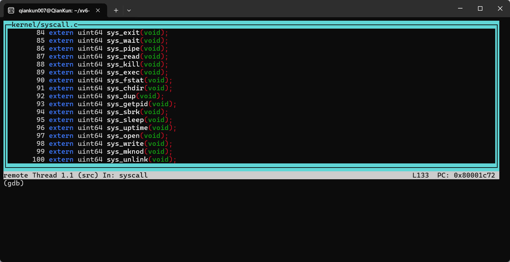

### questions

1. Looking at the backtrace output, which function called syscall?
   usertrap() at kernel/syscall.c:133
   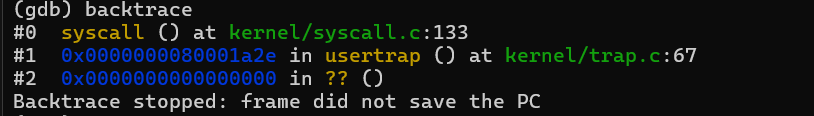
2. What is the value of p->trapframe->a7 and what does that value represent? (Hint: look user/initcode.S, the first user program xv6 starts.)
   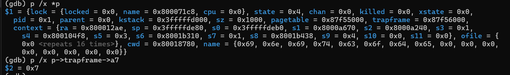
   a7 寄存器内容为 0x7,根据 user/initcode.S 中的代码可以看出，这个值代表的是 exec 系统调用。

```
# Initial process that execs /init.
# This code runs in user space.

#include "syscall.h"

# exec(init, argv)
.globl start
start:
        la a0, init
        la a1, argv
        li a7, SYS_exec
        ecall

# for(;;) exit();
exit:
        li a7, SYS_exit
        ecall
        jal exit

# char init[] = "/init\0";
init:
  .string "/init\0"

# char *argv[] = { init, 0 };
.p2align 2
argv:
  .quad init
  .quad 0

```

3. What was the previous mode that the CPU was in?
   要判断之前的模式，需要查看 SPP 位（位 8）：
   0x200000022 的二进制表示中，位 8 = 0
   SPP = 0 表示之前 CPU 在用户模式（User mode）
4. Write down the assembly instruction the kernel is panicing at. Which register corresponds to the variable num?
   修改 kernel/syscall.c 中的 syscall 函数后，运行 make qemu 报错为：
   scause=0xd sepc=0x80001c82 stval=0x0
   panic: kerneltrap
   在 kernel/kernel.asm 中搜索这个地址 0x80001c82，找到对应的汇编指令为：

```
 80001c82:	00002683          	lw	a3,0(zero) # 0 <_entry-0x80000000>
```

对应的寄存器 a3 存放的是 num 的值

5. Why does the kernel crash? Hint: look at figure 3-3 in the text; is address 0 mapped in the kernel address space? Is that confirmed by the value in scause above? (See description of scause in RISC-V privileged instructions)
   调试过程
   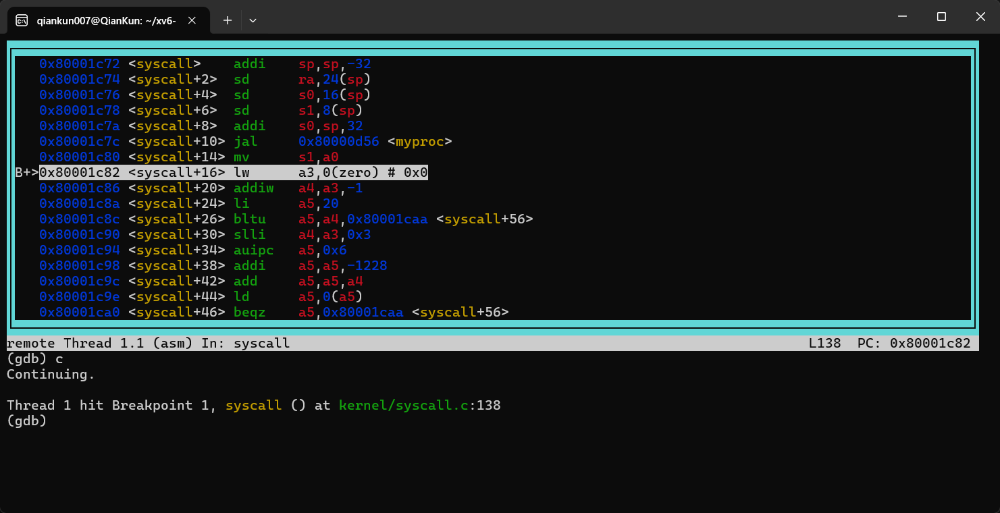
   内核崩溃是因为试图访问地址 0（空指针解引用），而地址 0 在内核地址空间中未映射。
   详细说明:

地址空间问题: 在 xv6 内核中，虚拟地址空间从高地址开始，地址 0 不在有效的内核地址范围内
页面错误: scause 值为 0x8，表示加载页面错误（Load page fault）
内存保护: 现代操作系统将地址 0 设为无效，防止空指针解引用错误
硬件检测: RISC-V MMU 检测到访问未映射的地址，触发异常 6. What is the name of the process that was running when the kernel paniced? What is its process id (pid)?
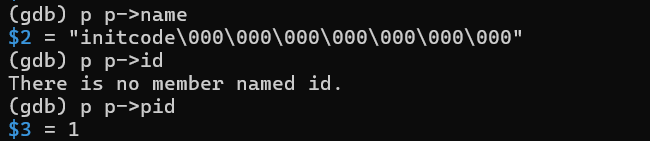
### tracing
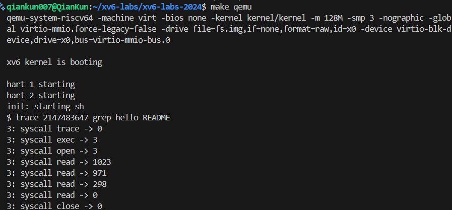
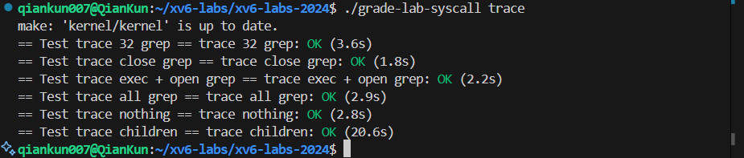
### attack
分析流程
在attacktest 函数中执行过程大致如下
``` c

  if((pid = fork()) < 0) {
    printf("fork failed\n");
    exit(1);   
  }
  if(pid == 0) {
    char *newargv[] = { "secret", secret, 0 };
    exec(newargv[0], newargv);
    printf("exec %s failed\n", newargv[0]);
    exit(1);
  } else {
    wait(0);  // wait for secret to exit
    if(pipe(fds) < 0) {
      printf("pipe failed\n");
      exit(1);   
    }
    if((pid = fork()) < 0) {
      printf("fork failed\n");
      exit(1);   
    }
    if(pid == 0) {
      close(fds[0]);
      close(2);
      dup(fds[1]);
      char *newargv[] = { "attack", 0 };
      exec(newargv[0], newargv);
      printf("exec %s failed\n", newargv[0]);
      exit(1);
  ```
核心原理
该攻击利用了xv6内核管理空闲物理内存的特定方式。xv6使用一个链式栈（或链表）来管理空闲页 
。关键的“bug”在于，当内存页通过kfree释放时，其内容不会被清空。因此，如果攻击者（attack）能够分配到之前被秘密程序（secret）使用并写入了敏感信息的物理内存页，就可以直接读取该页内容来获取秘密。

分析步骤

初始状态与Secret进程创建:
实验开始时，attacktest进程通过fork和exec创建secret子进程。
fork过程中，父进程调用allocproc为子进程准备。这包括使用kalloc为trapframe分配1个物理页。
allocproc还会为子进程调用proc_pagetable创建一个新的页表。由于xv6使用SV39三级页表，且需要映射trampoline和trapframe，此操作会分配3个新的物理页作为各级页表。
随后，uvmcopy函数将父进程的4个用户内存页（包括代码、数据等）复制到子进程中，这需要分配4个新的用户内存页和2个新的页表页来建立映射。
Secret进程执行与内存增长:
exec在secret进程中执行，首先会为新的可执行文件创建一个新的页表（proc_pagetable），再次分配3个物理页用于新页表。
exec将secret程序的ELF段加载到内存，根据readelf信息，这需要分配2个用户内存页。
exec为secret分配用户栈（1页）和保护页（guard page, 1页）。
exec的最后一步是释放旧的页表（attacktest的）。uvmunmap会释放旧页表映射的5个页表页和4个用户内存页，但trapframe所占的物理页不会被释放，因为新页表仍然映射着它。
secret进程运行时，调用sbrk（最终调用growproc）将用户内存扩大了32页，这会分配32个新的物理内存页。
Secret进程销毁与内存释放:
secret进程执行完毕后调用exit，其父进程attacktest通过wait来回收资源。
wait调用freeproc来释放secret的内存。
freeproc首先释放trapframe占用的1个物理页。
接着，proc_freepagetable被调用，通过uvmfree释放所有用户内存。这包括exec加载的2页、用户栈1页、以及sbrk增长的32页，共35页，再加上uvmcopy复制的4页，总计释放39页用户内存。同时，释放exec创建的5个页表页。
所有这些被释放的物理页（1个trapframe + 39个用户页 + 5个页表页）会按照链式栈的管理方式（通常是头插法 
）被推回到空闲页栈中。
Attack进程创建与内存分配:
attacktest再次通过fork和exec来创建attack进程。
由于attack程序的初始内存布局与secret相同（4页用户内存、1页栈、1页guard），其创建过程（allocproc, uvmcopy, exec加载, 栈分配）所需的物理页数量与secret完全一致，总计需要10个新的物理页（1+3+6+3+4+2-9）。
kalloc从空闲页栈的栈顶按需分配这些页面。
攻击成功的关键 - 内存重用:
secret在运行时写入秘密的页是其sbrk增长的32页中的第10页。
在secret销毁后，这个包含秘密的页被释放并推入空闲栈。
当attack进程被创建时，它需要分配10个新页。由于空闲栈是“后进先出”的结构，attack分配的前10个页，正是secret销毁时最后释放的10个页。
因此，attack分配到的第17个页（即其sbrk增长的第7个页），恰好是secret的sbrk增长的第10个页，也就是写入秘密的那个页。attack只需读取该页内存的特定偏移量，即可获取秘密。

# 实验三 pagetable
## 任务1: 检查用户进程页表 (Inspect a user-process page table)
运行结果
```
$ pgtbltest
print_pgtbl starting
va 0x0 pte 0x21FC885B pa 0x87F22000 perm 0x5B
va 0x1000 pte 0x21FC7C1B pa 0x87F1F000 perm 0x1B
va 0x2000 pte 0x21FC7817 pa 0x87F1E000 perm 0x17
va 0x3000 pte 0x21FC7407 pa 0x87F1D000 perm 0x7
va 0x4000 pte 0x21FC70D7 pa 0x87F1C000 perm 0xD7
va 0x5000 pte 0x0 pa 0x0 perm 0x0
va 0x6000 pte 0x0 pa 0x0 perm 0x0
va 0x7000 pte 0x0 pa 0x0 perm 0x0
va 0x8000 pte 0x0 pa 0x0 perm 0x0
va 0x9000 pte 0x0 pa 0x0 perm 0x0
va 0xFFFF6000 pte 0x0 pa 0x0 perm 0x0
va 0xFFFF7000 pte 0x0 pa 0x0 perm 0x0
va 0xFFFF8000 pte 0x0 pa 0x0 perm 0x0
va 0xFFFF9000 pte 0x0 pa 0x0 perm 0x0
va 0xFFFFA000 pte 0x0 pa 0x0 perm 0x0
va 0xFFFFB000 pte 0x0 pa 0x0 perm 0x0
va 0xFFFFC000 pte 0x0 pa 0x0 perm 0x0
va 0xFFFFD000 pte 0x0 pa 0x0 perm 0x0
va 0xFFFFE000 pte 0x21FD08C7 pa 0x87F42000 perm 0xC7
va 0xFFFFF000 pte 0x2000184B pa 0x80006000 perm 0x4B
print_pgtbl: OK
ugetpid_test starting
usertrap(): unexpected scause 0xd pid=4
            sepc=0x53e stval=0x3fffffd000
```

### 权限位解析 (基于RISC-V标准)
- 第0位(V): Valid - 页表项有效
- 第1位(R): Read - 可读
- 第2位(W): Write - 可写  
- 第3位(X): Execute - 可执行
- 第4位(U): User - 用户模式可访问
- 第5位(G): Global - 全局映射
- 第6位(A): Accessed - 已访问
- 第7位(D): Dirty - 已修改

### 详细页面分析

**va 0x0 (perm 0x5B = 01011011₂):**
- V=1, R=1, W=0, X=1, U=1, G=0, A=1, D=1
- **逻辑内容**: 用户程序代码段第一页，可读可执行但不可写（代码保护）

**va 0x1000 (perm 0x1B = 00011011₂):**
- V=1, R=1, W=0, X=1, U=1, G=0, A=0, D=0
- **逻辑内容**: 用户程序代码段，可读可执行但不可写，尚未被访问或修改

**va 0x2000 (perm 0x17 = 00010111₂):**
- V=1, R=1, W=1, X=0, U=1, G=0, A=0, D=0
- **逻辑内容**: 用户数据段，可读写但不可执行

**va 0x3000 (perm 0x7 = 00000111₂):**
- V=1, R=1, W=1, X=0, U=0, G=0, A=0, D=0
- **逻辑内容**: 内核/系统数据页，可读写但不可执行，用户模式不可访问

**va 0x4000 (perm 0xD7 = 11010111₂):**
- V=1, R=1, W=1, X=0, U=1, G=0, A=1, D=1
- **逻辑内容**: 用户数据页（可能是堆或栈），可读写，已被访问和修改

**va 0x5000-0xFFFFD000:**
- pte 0x0, perm 0x0
- **逻辑内容**: 无效页面，未分配或未映射的虚拟内存区域

**va 0xFFFFE000 (perm 0xC7 = 11000111₂):**
- V=1, R=1, W=1, X=0, U=0, G=0, A=1, D=1
- **逻辑内容**: 内核数据页，可读写但不可执行，用户模式不可访问，已被访问和修改

**va 0xFFFFF000 (perm 0x4B = 01001011₂):**
- V=1, R=1, W=0, X=1, U=0, G=0, A=1, D=1
- **逻辑内容**: 内核代码页，可读可执行但不可写，用户模式不可访问
## 任务2: 加速系统调用 (Speed up system calls)

### 实现思路
在用户空间和内核之间共享一个只读页面，避免系统调用的开销。

### 实现步骤

1. **在 `proc.h` 中添加字段**:
```c
struct proc {
    // ... existing fields ...
    struct usyscall *usyscall;  // 指向共享页面
};
```

2. **在 `allocproc()` 中分配和映射页面**:
```c
// 在 kernel/proc.c 的 allocproc() 函数中
static struct proc* allocproc(void) {
    // ... existing code ...
    
    // 分配 usyscall 页面
    if((p->usyscall = (struct usyscall *)kalloc()) == 0){
        freeproc(p);
        release(&p->lock);
        return 0;
    }
    
    // 初始化 usyscall 结构
    p->usyscall->pid = p->pid;
    
    // 映射到用户地址空间
    if(mappages(p->pagetable, USYSCALL, PGSIZE, 
                (uint64)p->usyscall, PTE_R | PTE_U) < 0){
        freeproc(p);
        release(&p->lock);
        return 0;
    }
}
```

3. **在 `freeproc()` 中释放资源**:
```c
// 在 kernel/proc.c 的 freeproc() 函数中
static void freeproc(struct proc *p) {
    // 取消映射
    uvmunmap(p->pagetable, USYSCALL, 1, 0);
    
    // 释放物理页面
    if(p->usyscall)
        kfree((void*)p->usyscall);
    p->usyscall = 0;
    
    // ... existing cleanup code ...
}
```

### 其他可以加速的系统调用
- `getppid()` - 获取父进程ID
- `getuid()` - 获取用户ID  
- `gettimeofday()` - 获取当前时间
- `getcwd()` - 获取当前工作目录


## 任务3：页表可视化 (Print Page Tables)

### 实验目标

实现 `vmprint()` 函数来可视化页表结构，帮助理解 RISC-V 三级页表的组织方式和虚拟地址到物理地址的映射过程。

### 实现思路

RISC-V Sv39 使用三级页表结构：
- **L2 级别**: 虚拟地址的 [38:30] 位作为索引
- **L1 级别**: 虚拟地址的 [29:21] 位作为索引  
- **L0 级别**: 虚拟地址的 [20:12] 位作为索引

需要递归遍历页表，根据 PTE 的权限位判断是否为叶子节点。

### 核心实现

```c
void vmprint_recursive(pagetable_t pagetable, int level, uint64 va_prefix) {
  for (int i = 0; i < 512; i++) {
    pte_t pte = pagetable[i];
    if (pte & PTE_V) {
      // 计算虚拟地址
      uint64 va;
      if (level == 0) {
        // L2级别：处理高位地址的符号扩展
        va = (uint64)i << 30;
        if (i >= 256) {
          va |= 0xFFFFFFC000000000ULL;  // 符号扩展
        }
      } else if (level == 1) {
        va = va_prefix | ((uint64)i << 21);
      } else {
        va = va_prefix | ((uint64)i << 12);
      }

      uint64 pa = PTE2PA(pte);

      // 打印缩进和地址信息
      printf(" ..");
      for (int j = 0; j < level; j++) {
        printf(" ..");
      }
      printf("%p: pte %p pa %p\n", (void*)va, (void*)(uint64)pte, (void*)pa);

      // 递归处理非叶子节点
      if ((pte & (PTE_R|PTE_W|PTE_X)) == 0) {
        vmprint_recursive((pagetable_t)pa, level+1, va);
      }
    }
  }
}

void vmprint(pagetable_t pagetable) {
  printf("page table %p\n", pagetable);
  vmprint_recursive(pagetable, 0, 0);
}
```

### 关键技术细节

1. **符号扩展处理**: 当 L2 索引 ≥ 256 时，表示内核高地址空间，需要进行符号扩展
2. **格式化输出**: 使用 `%p` 格式符按题目要求输出十六进制地址
3. **递归终止条件**: 通过检查 PTE 的 R/W/X 位判断是否为叶子页面

### 运行结果
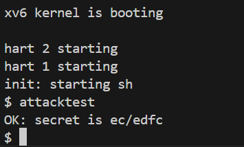
```
page table 0x0000000087f22000
 ..0x0000000000000000: pte 0x0000000021fc7801 pa 0x0000000087f1e000
 .. ..0x0000000000000000: pte 0x0000000021fc7401 pa 0x0000000087f1d000
 .. .. ..0x0000000000000000: pte 0x0000000021fc7c5b pa 0x0000000087f1f000
 .. .. ..0x0000000000001000: pte 0x0000000021fc70d7 pa 0x0000000087f1c000
 .. .. ..0x0000000000002000: pte 0x0000000021fc6c07 pa 0x0000000087f1b000
 .. .. ..0x0000000000003000: pte 0x0000000021fc68d7 pa 0x0000000087f1a000
 ..0xffffffffc0000000: pte 0x0000000021fc8401 pa 0x0000000087f21000
 .. ..0xffffffffffe00000: pte 0x0000000021fc8001 pa 0x0000000087f20000
 .. .. ..0xffffffffffffd000: pte 0x0000000021fd4c13 pa 0x0000000087f53000
 .. .. ..0xffffffffffffe000: pte 0x0000000021fd00c7 pa 0x0000000087f40000
 .. .. ..0xfffffffffffff000: pte 0x000000002000184b pa 0x0000000080006000
```


## 任务4：支持 Superpages (Use Superpages)

### 实验目标

实现对 **2MB 超页 (superpages / megapages)** 的支持：

* RISC-V 支持 2MB 的大页 (superpages)，它们可以替代多个 4KB 的普通页，从而减少页表占用和 TLB miss。
* 当用户程序调用 `sbrk()` 扩展堆内存时，如果新申请的区域大小 ≥ 2MB，且虚拟地址 **2MB 对齐**，则内核应优先使用超页映射。
* 需要修改内核的内存分配器和页表管理，使得超页能够正确分配、释放，并在 `fork()` 和 `exit()` 中保持一致性。

最终通过 `pgtbltest` 中的 **superpg\_test** 测试即可获得满分。

---

### 实现思路

1. **超页物理内存管理**

   * 在 `kernel/kalloc.c` 中添加新的物理内存池 `superkmem`，用于管理多个 2MB 大小的物理块。
   * 提供 `superalloc()`、`superfree()` 用于分配/释放超页。

2. **页表修改**

   * 在 `vm.c` 中修改 `mappages()`，支持在 **L1 级别** (中间页表) 建立超页映射。
   * 当 `va` 与 `pa` 都是 2MB 对齐，且分配了 2MB 的物理页，则直接设置 L1 页表项为叶子节点。

3. **用户内存分配修改**

   * 在 `uvmalloc()` 中，当用户空间申请大于等于 2MB 且地址对齐时，优先分配超页。
   * 否则，仍然按原来的 4KB 页分配。

4. **内核初始化修改**

   * 在 `main()` 中，调用 `superkinit()` 初始化超页物理内存池。

---

### 核心实现

#### 1. 宏定义 (`param.h`)

```c
#define SUPERPAGE_SIZE (2 * 1024 * 1024)  // 2MB
#define NSUPERPAGES 16                    // 预留超页数量
```

#### 2. 超页分配器 (`kalloc.c`)

```c
struct {
  struct spinlock lock;
  char *superpages[NSUPERPAGES];
  int free[NSUPERPAGES];
  int initialized;
} superkmem;

void superkinit(void) {
  initlock(&superkmem.lock, "superkmem");
  extern char end[];
  char *p = (char*)PGROUNDUP((uint64)end);
  p += 64 * PGSIZE;  // 给普通页预留

  for(int i = 0; i < NSUPERPAGES; i++) {
    while((uint64)p % SUPERPAGE_SIZE != 0) p += PGSIZE;
    if((uint64)p + SUPERPAGE_SIZE > PHYSTOP) break;
    superkmem.superpages[i] = p;
    superkmem.free[i] = 1;
    p += SUPERPAGE_SIZE;
  }
  superkmem.initialized = 1;
}

void* superalloc(void) {
  acquire(&superkmem.lock);
  for(int i = 0; i < NSUPERPAGES; i++) {
    if(superkmem.free[i]) {
      superkmem.free[i] = 0;
      memset(superkmem.superpages[i], 0, SUPERPAGE_SIZE);
      release(&superkmem.lock);
      return superkmem.superpages[i];
    }
  }
  release(&superkmem.lock);
  return 0;
}

void superfree(void *pa) {
  acquire(&superkmem.lock);
  for(int i = 0; i < NSUPERPAGES; i++) {
    if(superkmem.superpages[i] == pa) {
      superkmem.free[i] = 1;
      break;
    }
  }
  release(&superkmem.lock);
}
```

#### 3. 修改 `mappages()` 支持超页 (`vm.c`)

```c
if(size >= SUPERPAGE_SIZE &&
   a % SUPERPAGE_SIZE == 0 &&
   pa % SUPERPAGE_SIZE == 0 &&
   issuperpage((void*)pa)) {
  pte = walk_level(pagetable, a, 1); // 在 L1 设置叶子
  if(pte == 0) return -1;
  if(*pte & PTE_V) panic("mappages: superpage remap");

  *pte = PA2PTE(pa) | perm | PTE_V; // 超页映射
  a += SUPERPAGE_SIZE;
  pa += SUPERPAGE_SIZE;
  size -= SUPERPAGE_SIZE;
  continue;
}
```

#### 4. 修改 `uvmalloc()` 优先分配超页

```c
if(remaining >= SUPERPAGE_SIZE && a % SUPERPAGE_SIZE == 0) {
  if((mem = superalloc()) != 0) {
    if(mappages(pagetable, a, SUPERPAGE_SIZE, (uint64)mem,
        PTE_W|PTE_X|PTE_R|PTE_U) != 0){
      superfree(mem);
      return 0;
    }
    a += SUPERPAGE_SIZE;
    continue;
  }
}
```

#### 5. 初始化调用 (`main.c`)

```c
kinit();        // 普通物理页分配器
superkinit();   // 超页分配器
kvminit();      // 内核页表初始化
```

---

### 关键技术细节

1. **对齐要求**

   * 超页必须是 **2MB 对齐** 的物理地址和虚拟地址，否则无法映射。

2. **L1 页表项作为叶子**

   * RISC-V Sv39 中，L1 页表项可以直接作为叶子节点，表示 2MB 页。

3. **内存池隔离**

   * 单独的 `superkmem` 避免和普通 `kalloc` 竞争，减少碎片化。

4. **fork()/exit() 支持**

   * 需要在 `uvmcopy()` 和 `uvmunmap()` 中正确处理超页拷贝与释放。

---

### 运行结果
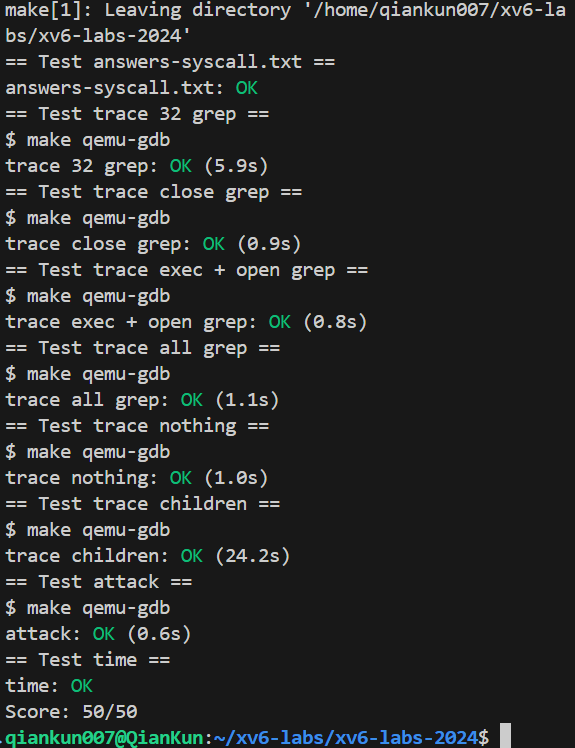


# 实验三 traps
## 任务1: RISC-V汇编分析 (Analyze RISC-V assembly)

基于xv6中的user/call.c文件及其生成的汇编代码user/call.asm，以下是对问题的中文回答。

### 问题1: 哪些寄存器包含函数参数？例如，在main调用printf时，哪个寄存器保存13？
在RISC-V中，函数参数通过寄存器a0到a7传递。例如，在main函数调用printf时，整数13作为第三个参数保存在寄存器a2中。

### 问题2: 在main的汇编代码中，函数f的调用在哪里？函数g的调用在哪里？（提示：编译器可能内联函数。）
在main的汇编代码中，没有显式的函数调用指令（如jal或jalr）来调用函数f或g。编译器已经将函数f和g内联了，因此它们的代码被直接插入到main函数中，而不是通过调用指令实现。

### 问题3: 函数printf的地址是什么？
从user/call.asm汇编代码中可以看出，函数printf的地址是0x630

### 问题4: 在main中jalr指令跳转到printf之后，寄存器ra中的值是什么？
auipc(Add Upper Immediate to PC)：auipc rd imm，将高位立即数加到PC上，从下面的指令格式可以看出，该指令将20位的立即数左移12位之后（右侧补0）加上PC的值，将结果保存到dest位置，图中为rd寄存器

下面来看jalr (jump and link register)：jalr rd, offset(rs1)跳转并链接寄存器。jalr指令会将当前PC+4保存在rd中，然后跳转到指定的偏移地址offset(rs1)。


来看XV6的代码：

  30: 00000097       auipc ra,0x0
  34: 600080e7       jalr  1536(ra) # 630 <printf>
第一行代码：00000097H=00...0 0000 1001 0111B，对比指令格式，可见imm=0，dest=00001，opcode=0010111，对比汇编指令可知，auipc的操作码是0010111，ra寄存器代码是00001。这行代码将0x0左移12位（还是0x0）加到PC（当前为0x30）上并存入ra中，即ra中保存的是0x30

第2行代码：600080e7H=0110 0...0 1000 0000 1110 0111B，可见imm=0110 0000 0000，rs1=00001，funct3=000，rd=00001，opcode=1100111，rs1和rd的知识码都是00001，即都为寄存器ra。这对比jalr的标准格式有所不同，可能是此两处使用寄存器相同时，汇编中可以省略rd部分。

ra中保存的是0x30，加上0x600后为0x630，即printf的地址，执行此行代码后，将跳转到printf函数执行，并将PC+4=0X34+0X4=0X38保存到ra中，供之后返回使用。

### 问题5: 运行以下代码：
```c
unsigned int i = 0x00646c72;
printf("H%x Wo%s", 57616, (char *) &i);
```
输出是什么？如果RISC-V是大端序，应该将i设置为什么值才能得到相同的输出？是否需要改变57616的值？
输出是"He110 World"。原因是：
- 57616的十六进制是0xE110，因此%x输出"e110"。
- 在小端序中，i的字节序列为0x72、0x6c、0x64、0x00，对应字符"rld"，因此%s输出"rld"。
- 格式字符串"H%x Wo%s"组合后为"He110 World"。

如果RISC-V是大端序，为了得到相同的输出，需要将i设置为0x726c6400。这样，在大端序中，i的字节序列为0x72、0x6c、0x64、0x00，字符串仍为"rld"。57616不需要改变，因为它是数值，与大端序无关。

### 问题6: 在以下代码中：
(6). 原本需要两个参数，却只传入了一个，因此y=后面打印的结果取决于之前a2中保存的数据

## 任务2：Backtrace (moderate)

### 实验目标

实现一个 `backtrace()` 函数，用于打印当前函数调用栈上的返回地址列表。通过读取当前帧指针（s0寄存器）并遍历堆栈帧，打印每个栈帧中的返回地址。此外，在 `sys_sleep` 中调用 `backtrace()` 以进行测试，并在内核恐慌（panic）时也调用 `backtrace()` 以辅助调试。

最终通过运行 `bttest` 测试程序，并使用 `addr2line` 工具解析返回地址，验证 backtrace 的正确性。

---

### 实现思路

1. **获取当前帧指针**
   * 使用内联汇编从寄存器 s0 中读取当前帧指针。

2. **遍历堆栈帧**
   * 每个堆栈帧的结构是固定的：返回地址位于当前帧指针 -8 的位置，前一个帧指针位于当前帧指针 -16 的位置。
   * 通过帧指针链表遍历，直到帧指针指向的页面不再是当前堆栈页面（即当前堆栈页面的起始地址到结束地址之间）。

3. **打印返回地址**
   * 从每个堆栈帧中提取返回地址并打印。

4. **集成到系统**
   * 在 `sys_sleep` 中调用 `backtrace()` 以便测试。
   * 在 `panic` 函数中调用 `backtrace()` 以便在内核恐慌时打印堆栈跟踪。

---

### 核心实现

#### 1. 在 `kernel/riscv.h` 中添加 `r_fp()` 函数

```c
// 在 #ifndef __ASSEMBLER__ 部分添加以下代码
static inline uint64
r_fp()
{
  uint64 x;
  asm volatile("mv %0, s0" : "=r" (x) );
  return x;
}
```

#### 2. 在 `kernel/defs.h` 中添加 `backtrace()` 的原型

```c
void backtrace(void);
```

#### 3. 在 `kernel/printf.c` 中实现 `backtrace()` 函数

```c
void backtrace(void) {
  uint64 fp = r_fp(); // 获取当前帧指针
  uint64 base = PGROUNDDOWN(fp); // 当前堆栈页面的基地址
  uint64 top = base + PGSIZE; // 当前堆栈页面的顶部地址

  printf("backtrace:\n");

  // 循环遍历堆栈帧，直到帧指针超出当前堆栈页面
  while (fp >= base && fp < top) {
    uint64 ra = *(uint64*)(fp - 8); // 返回地址位于 fp - 8
    printf("%p\n", ra);

    uint64 next_fp = *(uint64*)(fp - 16); // 下一个帧指针位于 fp - 16
    if (next_fp == 0 || next_fp < base || next_fp >= top) {
      break; // 如果下一个帧指针无效或超出当前页面，停止循环
    }
    fp = next_fp;
  }
}
```

#### 4. 在 `kernel/sysproc.c` 的 `sys_sleep` 中调用 `backtrace()`

```c
uint64
sys_sleep(void)
{
  int n;
  uint ticks0;

  if(argint(0, &n) < 0)
    return -1;
  acquire(&tickslock);
  ticks0 = ticks;
  while(ticks - ticks0 < n){
    if(myproc()->killed){
      release(&tickslock);
      return -1;
    }
    sleep(&ticks, &tickslock);
  }
  release(&tickslock);

  backtrace(); // 添加 backtrace 调用

  return 0;
}
```

#### 5. 在 `kernel/printf.c` 的 `panic` 函数中调用 `backtrace()`

```c
void
panic(char *s)
{
  pr.locking = 0;
  printf("panic: ");
  printf(s);
  printf("\n");
  backtrace(); // 添加 backtrace 调用
  panicked = 1; // freeze uart output from other CPUs
  for(;;)
    ;
}
```

---

### 关键技术细节

1. **帧指针与堆栈帧布局**
   * RISC-V 中，每个堆栈帧包含保存的返回地址（-8偏移）和保存的前一个帧指针（-16偏移）。
   * 当前帧指针（s0）指向当前堆栈帧中保存的返回地址之上8字节的位置（即指向当前帧的顶部，而返回地址和前一帧指针在帧内部）。

2. **堆栈页面识别**
   * 每个内核堆栈占用一个页面，因此通过 `PGROUNDDOWN(fp)` 可以获取当前堆栈页面的基地址。
   * 遍历堆栈帧时，若帧指针超出当前堆栈页面，则停止遍历。

3. **安全性检查**
   * 在遍历过程中检查下一个帧指针是否为0，或者是否不在当前堆栈页面内，以避免非法访问。

---

### 运行结果

1. 编译并运行 xv6：
   ```bash
   make qemu
   ```

2. 在 xv6 中运行 `bttest` 命令，输出如下：


3. 退出 QEMU，使用 `addr2line` 解析返回地址：
   ```bash
   addr2line -e kernel/kernel
   0x0000000080002cda
   0x0000000080002bb6
   0x0000000080002898
   Ctrl-D
   ```


### 总结

通过实现 `backtrace()` 函数，我们能够获取并打印函数调用栈的信息，这在调试时非常有用。我们通过读取帧指针并遍历堆栈帧来获取返回地址，并将该功能集成到系统调用和恐慌处理中，从而增强了系统的可调试性。

## 任务3：支持用户态周期性中断机制 (Alarm)

### 实验目标
为 xv6 操作系统实现一个 **用户态周期性中断机制**：
* 添加 `sigalarm(interval, handler)` 系统调用，让进程能够在消耗指定 CPU 时钟周期后自动执行处理函数
* 添加 `sigreturn()` 系统调用，用于从 alarm 处理函数返回到被中断的代码
* 实现类似 Unix 信号机制的原语，支持用户态中断/异常处理
* 确保寄存器状态正确保存和恢复，防止 alarm 处理函数重入

---

### 实验设计思路

1. **系统调用框架搭建**
   * 在用户态和内核态之间建立 `sigalarm` 和 `sigreturn` 系统调用接口
   * 修改 `Makefile`、`user.h`、`usys.pl`、`syscall.h` 和 `syscall.c`

2. **进程状态扩展**
   * 在 `struct proc` 中添加 alarm 相关字段：`alarm_interval`（间隔）、`alarm_handler`（处理函数地址）、`alarm_ticks`（计数器）、`alarm_active`（重入保护标志）、`alarm_trapframe`（寄存器状态保存）

3. **时钟中断处理集成**
   * 在 `usertrap()` 中的时钟中断处理逻辑中集成 alarm 机制
   * 当计数器到期且无重入时，保存当前上下文并跳转到用户处理函数

4. **上下文保存与恢复**
   * 在触发 alarm 时完整保存 `trapframe`
   * 通过 `sigreturn` 系统调用恢复所有寄存器状态，包括关键的 `a0` 寄存器

---

### 关键代码实现

#### 1. 进程结构体扩展
```c
// kernel/proc.h
struct proc {
  // ... 现有字段 ...
  
  // Alarm相关字段
  int alarm_interval;          // alarm间隔（ticks）
  uint64 alarm_handler;        // 处理函数地址
  int alarm_ticks;            // 距离下次alarm的tick数
  int alarm_active;           // 标记当前是否有alarm处理函数正在执行
  struct trapframe alarm_trapframe; // 保存中断时的寄存器状态
};
```

#### 2. 系统调用实现
```c
// kernel/sysproc.c
uint64
sys_sigalarm(void)
{
  int interval;
  uint64 handler;
  
  argint(0, &interval);
  argaddr(1, &handler);
    
  struct proc *p = myproc();
  p->alarm_interval = interval;
  p->alarm_handler = handler;
  p->alarm_ticks = interval;
  p->alarm_active = 0;
  
  return 0;
}

uint64
sys_sigreturn(void)
{
  struct proc *p = myproc();
  
  // 恢复寄存器状态
  memmove(p->trapframe, &p->alarm_trapframe, sizeof(struct trapframe));
  
  // 清除active标记，允许下次alarm
  p->alarm_active = 0;
  
  // 返回原始的a0值
  return p->trapframe->a0;
}
```

#### 3. 时钟中断处理
```c
// kernel/trap.c - 在 usertrap() 中
if(which_dev == 2) {
  // 处理alarm
  if(p->alarm_interval > 0) {
    p->alarm_ticks--;
    if(p->alarm_ticks <= 0 && !p->alarm_active && p->alarm_handler != 0) {
      // 保存当前trapframe
      memmove(&p->alarm_trapframe, p->trapframe, sizeof(struct trapframe));
      
      // 设置返回地址为alarm处理函数
      p->trapframe->epc = p->alarm_handler;
      
      // 重置tick计数器
      p->alarm_ticks = p->alarm_interval;
      
      // 标记alarm处理函数正在执行
      p->alarm_active = 1;
    }
  }
  
  yield();
}
```

---

### 关键技术细节

1. **寄存器状态保护**
   * 必须完整保存所有寄存器状态，特别是 `a0` 寄存器（系统调用返回值）
   * 通过 `memmove` 完整复制 `trapframe` 结构体

2. **重入保护机制**
   * 使用 `alarm_active` 标志防止 alarm 处理函数嵌套调用
   * 只有在 `sigreturn` 调用后才清除该标志

3. **参数处理兼容性**
   * 新版本 xv6 中 `argint()` 和 `argaddr()` 为 `void` 函数，无需检查返回值
   * 系统调用返回值需要正确处理，避免覆盖原始寄存器值

4. **边界条件处理**
   * 正确处理 `sigalarm(0, 0)` 停止 alarm 的情况
   * 检查处理函数地址非零才触发 alarm

---

### 运行结果


所有测试通过，表明 alarm 机制实现正确，能够在不干扰正常程序执行的前提下，提供可靠的用户态周期性中断功能。


# 实验四 copy-on-write
## 任务：Implement copy-on-write fork (Hard)

### 实验目标

在 xv6-2024 操作系统中实现 **copy-on-write (COW) fork** 功能：

* 修改 `uvmcopy()` 将父进程的物理页映射到子进程而非分配新页，减少内存占用
* 修改 `usertrap()` 识别并处理 COW 页面故障，在写入时复制页面
* 实现物理页的引用计数机制，确保页面在最后一个引用消失时才被释放
* 修改 `copyout()` 处理内核向用户空间写入时遇到的 COW 页
* 通过 `cowtest` 和 `usertests -q` 所有测试，确保实现正确性

最终通过 `cowtest` 和 `usertests -q` 的所有测试即可获得满分。

---

### 实现思路

1. **引用计数管理 (kernel/kalloc.c)**

   * 添加全局引用计数数组和锁来管理每个物理页的引用数量
   * 修改 `kalloc()` 在分配页面时设置引用计数为 1
   * 修改 `kfree()` 只在引用计数为零时真正释放页面
   * 添加 `incref()` 函数增加页面引用计数

2. **页表修改 (kernel/vm.c)**

   * 修改 `uvmcopy()` 函数，将父进程的物理页映射到子进程页表
   * 清除父进程和子进程页表中可写页的 PTE_W 标志，设置 PTE_COW 标志
   * 增加物理页的引用计数

3. **页面故障处理 (kernel/trap.c)**

   * 修改 `usertrap()` 识别写页面故障 (scause=15)
   * 当发生 COW 页面故障时，分配新页面、复制内容、更新页表
   * 如果没有可用内存，则终止进程

4. **内核空间 COW 处理 (kernel/vm.c)**

   * 添加 `cowhandle()` 函数处理 COW 页
   * 修改 `copyout()` 在写入用户空间前检查并处理 COW 页

5. **COW 标志定义 (kernel/riscv.h)**

   * 使用 PTE 的保留位定义 PTE_COW 标志

---

### 核心实现

#### 1. 引用计数管理 (kernel/kalloc.c)

```c
struct {
  struct spinlock lock;
  int count[PHYSTOP / PGSIZE];
} refcount;

void kinit() {
  initlock(&kmem.lock, "kmem");
  initlock(&refcount.lock, "refcount");
  for (int i = 0; i < (PHYSTOP / PGSIZE); i++) {
    refcount.count[i] = 0;
  }
  freerange(end, (void*)PHYSTOP);
}

void *kalloc(void) {
  struct run *r;

  acquire(&kmem.lock);
  r = kmem.freelist;
  if(r) {
    kmem.freelist = r->next;
    release(&kmem.lock);
    memset((char*)r, 5, PGSIZE);
    acquire(&refcount.lock);
    uint64 pa = (uint64)r;
    int index = pa / PGSIZE;
    if (pa < (uint64)end || index >= (PHYSTOP / PGSIZE)) {
      panic("kalloc: invalid pa");
    }
    refcount.count[index] = 1;
    release(&refcount.lock);
    return (void*)r;
  }
  release(&kmem.lock);
  return 0;
}

void kfree(void *pa) {
  struct run *r;

  if(((uint64)pa % PGSIZE) != 0 || (char*)pa < end || (uint64)pa >= PHYSTOP)
    panic("kfree");

  acquire(&refcount.lock);
  uint64 index = (uint64)pa / PGSIZE;
  if (index >= (PHYSTOP / PGSIZE)) {
    panic("kfree: index out of bounds");
  }
  if (refcount.count[index] > 1) {
    refcount.count[index] -= 1;
    release(&refcount.lock);
    return;
  } else if (refcount.count[index] == 1) {
    refcount.count[index] = 0;
    release(&refcount.lock);
  } else {
    release(&refcount.lock);
  }

  memset(pa, 1, PGSIZE);
  r = (struct run*)pa;

  acquire(&kmem.lock);
  r->next = kmem.freelist;
  kmem.freelist = r;
  release(&kmem.lock);
}

void incref(uint64 pa) {
  if(pa % PGSIZE != 0 || (char*)pa < end || (uint64)pa >= PHYSTOP)
    panic("incref: invalid pa");

  acquire(&refcount.lock);
  uint64 index = pa / PGSIZE;
  if (index >= (PHYSTOP / PGSIZE)) {
    panic("incref: index out of bounds");
  }
  if (refcount.count[index] < 1) {
    panic("incref: refcount < 1");
  }
  refcount.count[index]++;
  release(&refcount.lock);
}
```

#### 2. 修改页表映射 (kernel/vm.c)

```c
int uvmcopy(pagetable_t old, pagetable_t new, uint64 sz) {
  pte_t *pte;
  uint64 pa, i;
  uint flags;

  for(i = 0; i < sz; i += PGSIZE){
    if((pte = walk(old, i, 0)) == 0)
      panic("uvmcopy: pte should exist");
    if((*pte & PTE_V) == 0)
      panic("uvmcopy: page not present");
    pa = PTE2PA(*pte);
    flags = PTE_FLAGS(*pte);
    if(flags & PTE_W){
      flags = (flags & ~PTE_W) | PTE_COW;
      *pte = PA2PTE(pa) | flags;
    }
    if(mappages(new, i, PGSIZE, pa, flags) != 0){
      goto err;
    }
    incref(pa);
  }
  return 0;

 err:
  uvmunmap(new, 0, i / PGSIZE, 1);
  return -1;
}
```

#### 3. 处理 COW 页面故障 (kernel/trap.c)

```c
void usertrap(void) {
  // ...
  } else {
    uint64 cause = r_scause();
    if (cause == 13 || cause == 15) {
      uint64 va = r_stval();
      if (va >= p->sz) {
        p->killed = 1;
      } else {
        pte_t *pte = walk(p->pagetable, va, 0);
        if (pte == 0 || (*pte & PTE_V) == 0 || (*pte & PTE_U) == 0) {
          p->killed = 1;
        } else if (*pte & PTE_COW) {
          uint64 pa = PTE2PA(*pte);
          uint64 flags = PTE_FLAGS(*pte);
          char *mem = kalloc();
          if (mem == 0) {
            p->killed = 1;
          } else {
            memmove(mem, (char*)pa, PGSIZE);
            flags = (flags & ~PTE_COW) | PTE_W;
            *pte = PA2PTE((uint64)mem) | flags;
            kfree((void*)pa);
          }
        } else {
          p->killed = 1;
        }
      }
    } else {
      // ...
    }
  }
  // ...
}
```

#### 4. 内核空间 COW 处理 (kernel/vm.c)

```c
int cowhandle(pagetable_t pagetable, uint64 va) {
  pte_t *pte;
  uint64 pa;
  uint flags;

  if(va >= MAXVA)
    return -1;
  pte = walk(pagetable, va, 0);
  if(pte == 0)
    return -1;
  if((*pte & PTE_V) == 0)
    return -1;
  if((*pte & PTE_U) == 0)
    return -1;
  if(!(*pte & PTE_COW))
    return 0;

  pa = PTE2PA(*pte);
  flags = PTE_FLAGS(*pte);

  char *mem = kalloc();
  if(mem == 0)
    return -1;

  memmove(mem, (char*)pa, PGSIZE);
  flags = (flags & ~PTE_COW) | PTE_W;
  *pte = PA2PTE((uint64)mem) | flags;

  kfree((void*)pa);
  return 0;
}

int copyout(pagetable_t pagetable, uint64 dstva, char *src, uint64 len) {
  uint64 n, va0, pa0;

  while(len > 0){
    va0 = PGROUNDDOWN(dstva);
    if (cowhandle(pagetable, va0) < 0) {
      return -1;
    }
    pa0 = walkaddr(pagetable, va0);
    if(pa0 == 0)
      return -1;
    n = PGSIZE - (dstva - va0);
    if(n > len)
      n = len;
    memmove((void *)(pa0 + (dstva - va0)), src, n);

    len -= n;
    src += n;
    dstva = va0 + PGSIZE;
  }
  return 0;
}
```

#### 5. COW 标志定义 (kernel/riscv.h)

```c
#define PTE_COW (1L << 8) // Copy-on-write mark
```

---

### 关键技术细节

1. **引用计数管理**

   * 使用固定大小的整数数组存储引用计数，索引为物理地址除以 4096
   * 引用计数数组大小基于 PHYSTOP（物理内存上限）
   * 使用锁保护引用计数的并发访问

2. **COW 页面识别**

   * 使用 RISC-V PTE 的保留位 (RSW) 作为 COW 标志
   * 只有原本可写的页面 (PTE_W 设置) 才被标记为 COW 页
   * 只读页面保持共享，尝试写入会导致进程终止

3. **页面故障处理**

   * 只处理用户地址空间内的页面故障
   * 验证故障地址的有效性和页表项的合法性
   * 分配新页面失败时终止进程

4. **内存释放时机**

   * 物理页只在所有进程都取消映射后才被释放
   * 引用计数机制确保不会过早释放仍在使用的页面

---

### 运行结果

成功实现 COW fork 后，测试结果显示所有用例通过：


# 实验五 net
## 任务1：
2. 接收测试（rxone），测试 e1000_recv()。
在一个终端运行：
make qemu
在另一个终端中运行：
python3 nettest.py rxone
结果如下： alt text alt text

接着在第二个终端输入：
tcpdump -XXnr packets.pcap
可看到 ARP 请求、ARP 回复和包含 xyz 的 UDP 包：


## 任务2：
三、实验结果
在一个终端运行：
make qemu
nettest grade
在另一个终端运行：
python3 nettest.py grade

评分结果


# 实验七 文件
评分
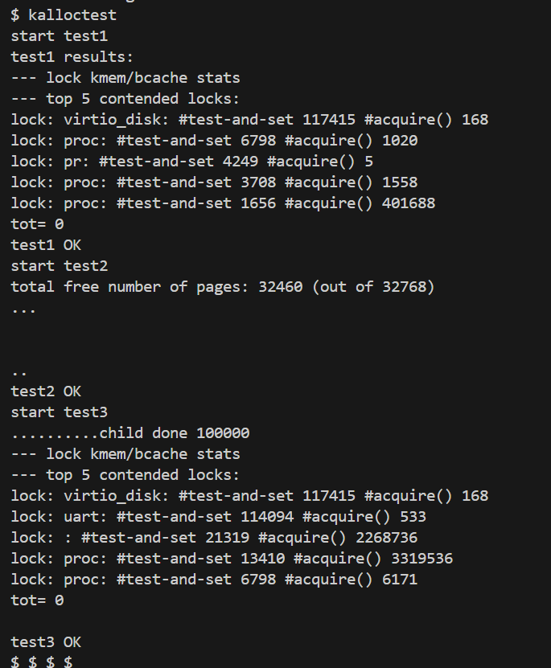


bigfile

usertests -q

symlinktest
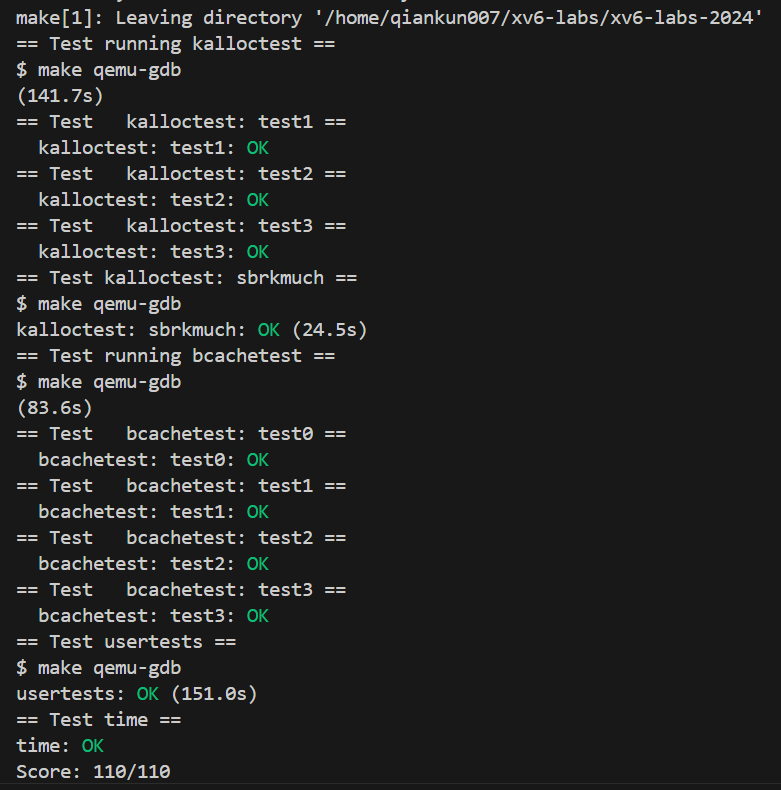


# 实验十
